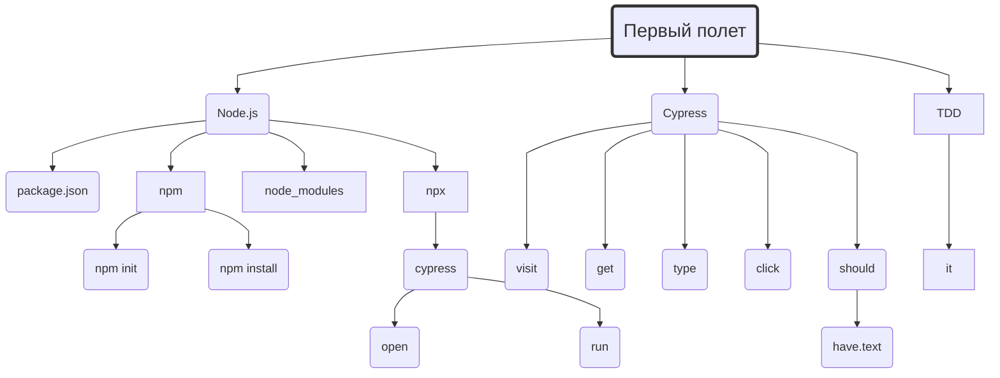
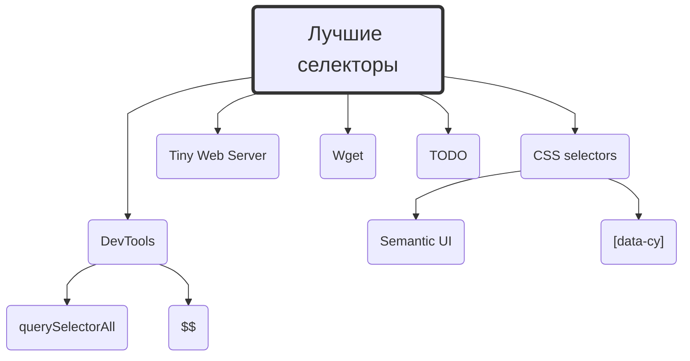
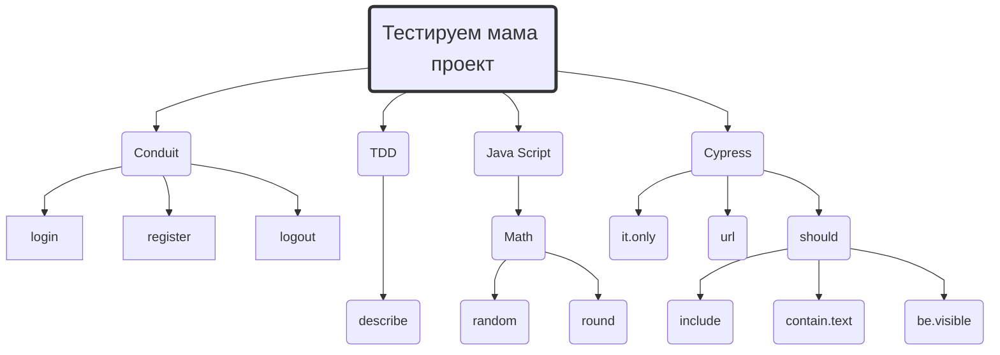
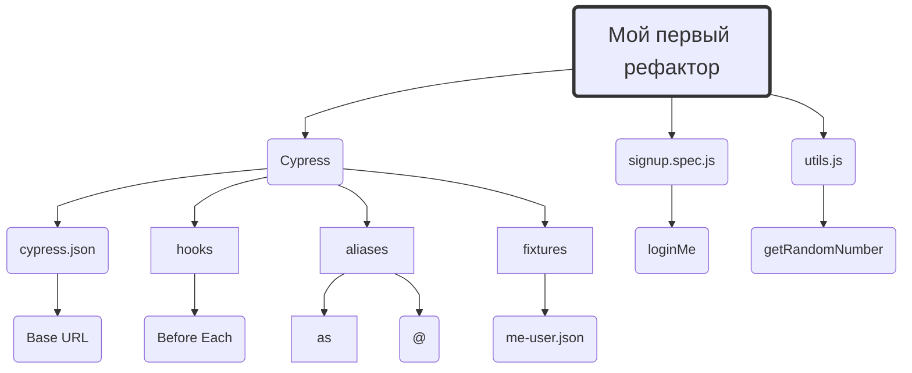

<style>

.marks {
  display: none !important;
}

h1 {
  background: #121FCF;
  font-size: 3em;
  background: linear-gradient(to right, #121FCF 0%, #CF1512 100%);
  -webkit-background-clip: text;
  -webkit-text-fill-color: transparent;
}

h1.title {
  margin-top: 0;
  font-size: 5em;
}

#slide {
  margin-top: 20px;
  padding: 20px 40px;
  background-color: #F1F3FC;
  border-radius: 10px;
}

#slide h1 {
  margin-top: 0;
}

</style>

<h1 class="title">Туториалы<br>по IT навыкам</h1>

```text circle hello_from_anton
{
  "time": 1.7,
  "video": "https://raw.githubusercontent.com/breslavsky/hello-cypress/main/assets/hello_from_anton.mp4"
}

Привет, [Anton](https://t.me/breslavsky_anton) на связи 🤙

Я — Тимлид и **разработчик** с более чем **15-летним** опытом. 

Мне 36, живу и работаю в Берлине, и у меня есть огромное желание **делиться** знаниями.

Я разработал серию практических туториалов по авто-тестам на **Cypress**

Чистый **концентрат** — все как на работе, сразу в бой.

Ну что? Погнали 👇
```

<section id="slide">

# Мой подход

Я сторонник **проблемно-ориентированного** ~~программирования~~ обучения:
1. Выполняя **практические действия** и сталкиваясь с **проблемами** — у тебя возникают вопросы.
2. Получая ответы, ты ловишь **ага-эффекты!** Чем больше таких эффектов — тем большему ты научишься!

На сложные вопросы и **концепты** — я даю свои **расширенные** комментарии.

</section>

# Менторство по Zoom

Каждый вторник и четверг я провожу свои **менторские стендапы** в Zoom для всех желающих.

Подробности и 🔔 анонсы новых туториалов в [Телеграмм](https://t.me/epic_one_hour)

Скринкасты и записи стендапов на 
<a href="https://www.youtube.com/@epic_one_hour" target="_blank" class="button">
  
</a>

# Туториалы по Cypress

Уникальный практический и 🔥 <b>бесплатный</b> курс по Cypress

Идеально подходит 🥳 для начала изучения программирования с нуля.

<details>
  <summary>Syllabus – учебный план&nbsp;</summary>









</details>

## 🦸 Путь героя

1. [Первый полет на Cypress](https://md.epic1h.com/cypress_test_flight)
2. [Находим лучшие селекторы](https://md.epic1h.com/best_selectors)
3. [Тестируем мама проект на Cypress](https://md.epic1h.com/test_mama_project)
4. [Мой первый рефактор в Cypress](https://md.epic1h.com/my_first_refactor)
5. [Фейк дата в тестах](https://md.epic1h.com/fake_data)
6. [Как устроен Cypress внутри](https://md.epic1h.com/deep_cypress)
7. [Заканчиваем мама проект](https://md.epic1h.com/finish_mama_project)
8. [Забавные кейсы](https://md.epic1h.com/fun_cases)

## 🥷 Путь ниндзя

9. [Тестируем API в Cypress](https://md.epic1h.com/test_api) ~"Черновик"
10. Обновляем Cypress до 12
11. Собираем Conduit локально
12. Запускаем тестирование через CI/CD
13. Деплоим проект на своем сервере
14. Визуальное тестирование через Cypress

# Ручное тестирование

1. [Ломаем приложение онлайн-банка](https://md.epic1h.com/became_a_tester)
1. [Организуем баг-трекинг в стартапе](https://md.epic1h.com/bug_tracking)
1. [Исследуем баги и пишем профессиональные баг-репорты](https://md.epic1h.com/perfect_bug_reports)

# Менторство

1. [Java Script](https://md.epic1h.com/js_mentor)

# Челленджы

1. [Спасти мир от хакера Hакатика](https://md.epic1h.com/save_the_world)

# Стримы

1. [Стрим-практикум: мемы учат](https://md.epic1h.com/memes_teach)
1. [ИИ решает тестовое задание по QA](https://www.youtube.com/watch?v=NP6LL5e52vU)
