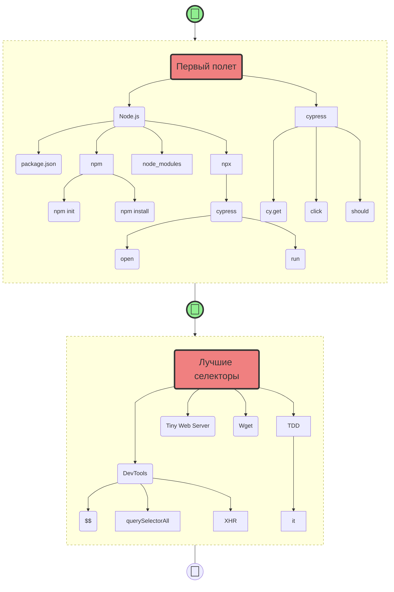

# Туториалы по ИТ навыкам

Привет, [Anton](https://t.me/breslavsky_anton) на связи 🤙

Перед тобой 👇 серия практических туториалов по авто-тестам на **Cypress**

Чистый **концентрат** — все как на работе, сразу в бой.

Я — Тимлид и **разработчик** с более чем **15-летним** опытом. 

Мне 36, живу и работаю в Берлине, и у меня есть огромное желание **делиться** знаниями.

# Мой подход

Я сторонник **проблемно-ориентированного** ~~программирования~~ обучения:
1. Выполняя **практические действия** и сталкиваясь с **проблемами** — у тебя возникают вопросы.
2. Получая ответы, ты ловишь **ага-эффекты!** Чем больше таких эффектов — тем большему ты научишься!

На сложные вопросы и **концепты** — я даю свои **расширенные** комментарии.

# +Менторство по Zoom

Каждый вторник и четверг я провожу свои **менторские онлайн стендапы** в Zoom для всех желающих.

Подробности и 🔔 анонсы новых туториалов в [Телеграмм](https://t.me/epic_one_hour)

Скринкасты и записи стендапов на 🎬[YouTube](https://www.youtube.com/@epic_one_hour)

# +Туториалы по Cypress

1. [Первый полет на Cypress](https://md.epic1h.com/cypress_test_flight)
2. [Находим лучшие селекторы](https://md.epic1h.com/best_selectors)
3. [Тестируем мама проект на Cypress](https://md.epic1h.com/test_mama_project)
4. [Мой первый рефактор в Cypress](https://md.epic1h.com/my_first_refactor)
5. [Фейк дата в тестах](https://md.epic1h.com/fake_data)
6. [Как устроен Cypress внутри](https://md.epic1h.com/deep_cypress)
7. [Заканчиваем мама проект](https://md.epic1h.com/finish_mama_project)
8. Тестирование API в Cypress
9. Обновляем Cypress до 12
10. Собираем проект локально
12. Запускаем тестирование по расписанию через CI/CD в GitLab
13. Деплоим проект на своем сервере
14. Визуальное тестирование через Cypress

## Силлабус

> **Syllabus** – учебный план 😂

# +Туториалы по ручному тестированию

1. [Ломаем приложение онлайн-банка](https://md.epic1h.com/became_a_tester)
1. [Организуем баг-трекинг в стартапе](https://md.epic1h.com/bug_tracking)
1. [Исследуем баги и пишем профессиональные баг-репорты](https://md.epic1h.com/perfect_bug_reports)

# +Менторство

1. [Java Script](https://md.epic1h.com/js_mentor)

# +Челленджы

1. [Спасти мир от хакера Hакатика](https://md.epic1h.com/save_the_world)

# +Стримы

1. [Стрим-практикум: мемы учат](https://md.epic1h.com/memes_teach)
