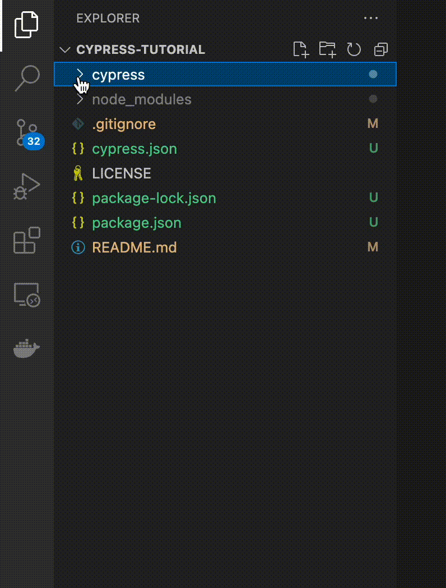

Туториал для `Cypress`

# 1. Ставим `Visual Code`

Ищем в Google `Visual Code`, скачиваем, устанавливаем.

Запускаем `Visual Code`.

# 2. Ставим `NodeJS`

`NodeJS` - среда выполнения `Java Script` менеджер пакетов `npm`.

Ищем в Google `Node JS`, скачиваем версию LTS (рекомендовано для большинства пользователей), устанавливаем.

Запускаем командную строку и вводим команду `node -v`

# 3. Инициализуем проект

Создаем папку `%/projects/cypress/tutorial`

В `Visual Code` от открываем папку проекта.

Открываем Терминал → Новый терминал в `Visual Code`.

Выполняем `npm init`, на все вопросы нажимаем `ENTER ↵` и в конце водим `yes`, `ENTER ↵`.

Проверяем, что в папке появился файл `package.json`

# 4. Ставим `Cypress`

Выполняем команду `npm install cypress`

В `package.json` добавляем команду `cypress` в раздел `scripts`:

```json
...
  "scripts": {
    "cypress": "cypress",
    "test": "echo \"Error: no test specified\" && exit 1"
  },
```

Выполняем команду `npm run cypress open`

Ждем, что появилась папка `cypress` внутри проекта и открылось окно `Cypress`.

В окне выбираем `todo.spec.js` и смотрим на то, что происходит.

В терминале нажимаем CTRL+C. `Cypress` должен закрыться.

# 5. Открываем `Google`

Из папки `cypress/integration` удаляем `1-getting-started` и `2-advanced-examples`.

<details>
  <summary>Показать как 🤔</summary>

  
  
</details>

В папке `cypress/integration` создаем файл `google.spec.js` содержимым:

```javascript
describe('Google', () => {

    before(() => {
        cy.visit('https://google.ru/');
    });

};
```

В терминале выполняем команду `npm run cypress open`

В `Cypress` выбираем `google.spec.js`

Видим что в `Chrome` под управлением `Cypress` открылся Google с сообщением о Cookie.

# 6. Принимаем куки

Обновляем код

```javascript
describe('Google', () => {

    before(() => {
        cy.visit('https://google.ru/');
    });

    it('Принять cookie', () => {
        cy.get('#L2AGLb > .QS5gu').click();
    });

};
```

# Артефакты

* Список рецептов https://example.cypress.io/
* Todo-приложение для тестирования https://example.cypress.io/todo
* Видео Cypress Automation для новичков https://www.youtube.com/watch?v=N0Eqlz5G-Jo
* Cypress для End2end тестирования. Первый взгляд https://www.youtube.com/watch?v=k7Z5_jJPOlU
