# Настройка рабочего места для занятий

Наши занятия проводятся в **небольших группах** для поддержки тесного контакта с мастером.

Мастеру важно, что бы каждый ученик **прошел весь** мастер класс целиком.

Для этого требуется, что бы мастер и ученик находились в тесном контакте на протяжении всего урока.

Мы хотим приблизить урок к формату офлайн занятий в аудитории, когда:
* Преподаватель видит экран каждого ученика.
* Преподаватель отмечает ошибки и дает рекомендации.
* Преподаватель сразу решает возникшие проблемы.

Для работы данного формата требуется предварительная подготовка рабочего места.

# Настройка OBS Studio

Скачай и установи [OBS Studio](https://obsproject.com/)

## Добавление экрана
- [ ] Запусти **OBS**.
- [ ] В области **Источники** выбери **Запись экрана**.

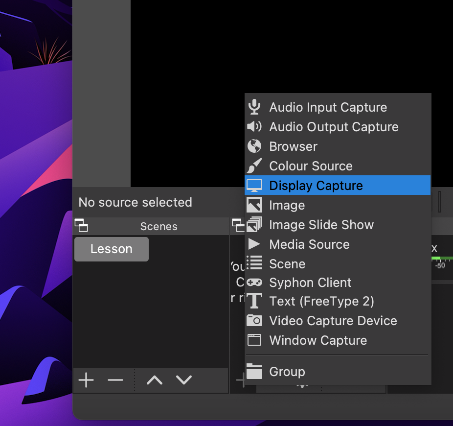

- [ ] В окне добавления нового источника ничего не меняя нажми **OK**.

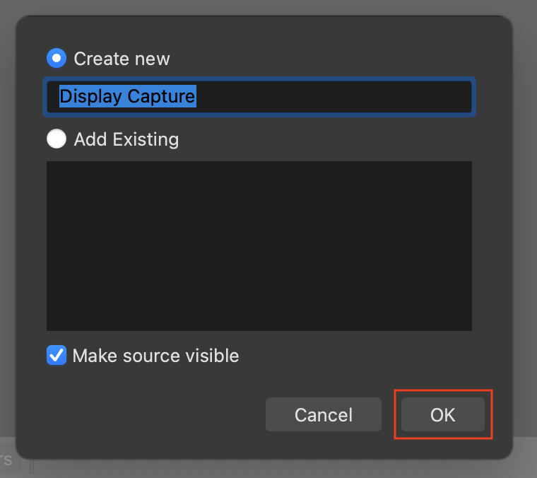

- [ ] Выбери нужный монитор и нажми **OK**.

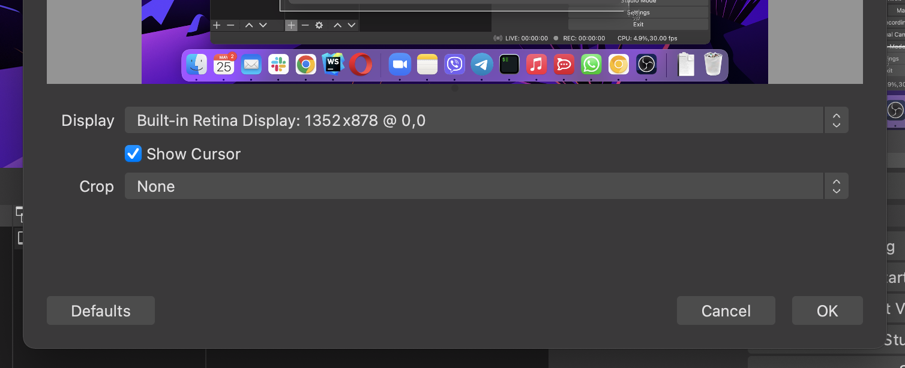

- [ ] Настрой размеры и позицию экрана на сцене.

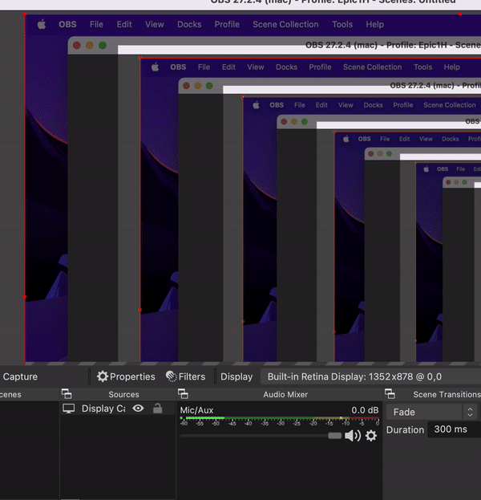

## Добавление камеры
- [ ] В области **Источники** выбери **Камера**.

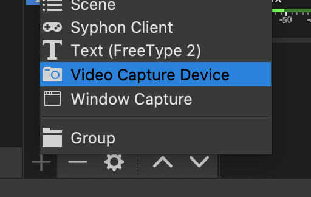

- [ ] В окне добавления нового источника ничего не меняя нажми **OK**.

- [ ] Выбери нужную камеру и **OK**.

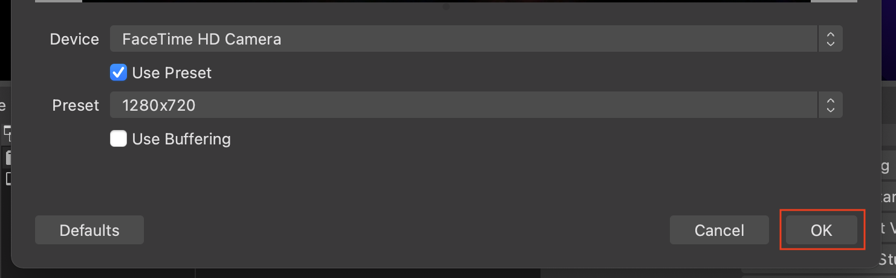

- [ ] Настрой размеры и позицию камеры на сцене.

## Добавление имени
- [ ] В области **Источники** выбери **Текст**.

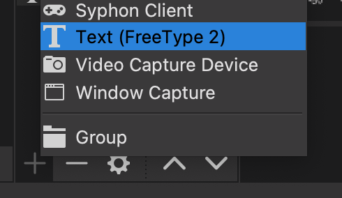

- [ ] В окне добавления нового источника ничего не меняя нажми **OK**.

- [ ] Введи свое имя на русском языке.

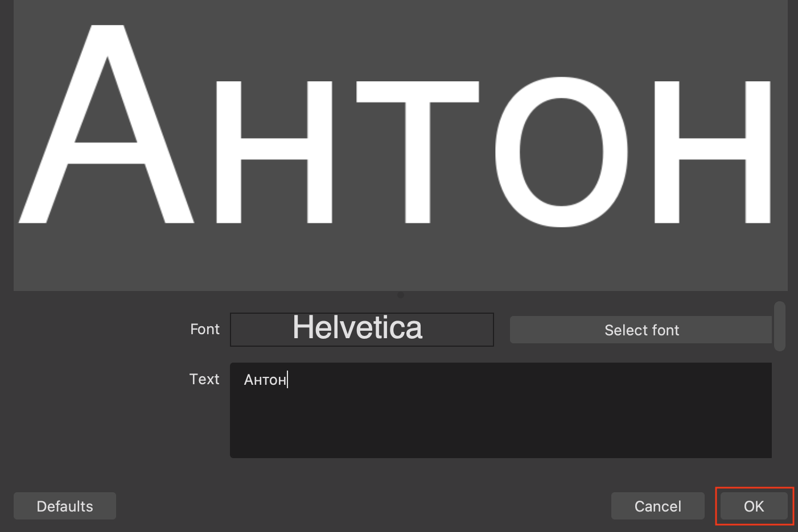

- [ ] Настрой размеры и позицию текста на сцене.

## Запуск виртуальной камеры
- [ ] Запусти виртуальную камеру **OBS**.

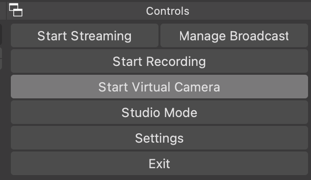

- [ ] Сверни приложение **OBS**.

# Настройка Zoom
- [ ] Открой настройки **Zoom**.

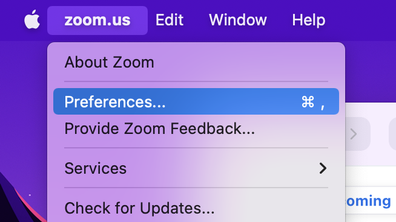

- [ ] В разделе **Видео** выбери камеру **OBS Virtual Camera**.

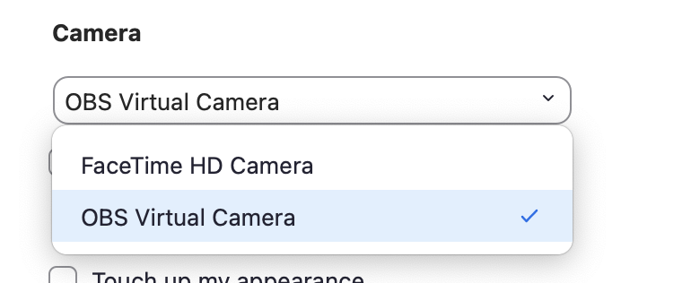

Ты готов к мастер-классу! В следующий раз тебе потребуется только запустить **OBS**.
