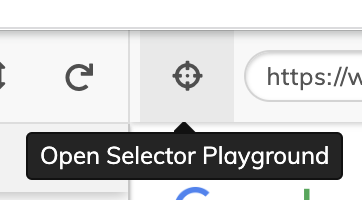

Находим лучшие селекторы 👇

* Научимся находить лучшие селекторы для элементов
* Изучим **лучшие практики** и **анти-паттерны** в тестировании

# 🙋‍♂️ Перед началом

* Вы установили `Visual Code` и `NodeJS`
* Вы инициалировали чистый проект в папке `%/projects/cypress/best_selectors`
* Вы установили `Cypress` в проект
* `Cypress` запускается через терминал

Выполните 1-4 шаг из мастер-класса [Первый полет на `Cypress`](cypress_test_flight.md)

Если не получилось 🙀 пишите в канал поддержки https://chat.epic1h.com/

# Шаги

## 1. Подготовка локального [Веб-сервера](https://ru.wikipedia.org/wiki/Веб-сервер)

Установим через терминал пакет `npm install tiny-server`

В `package.json` добавляем команду `start` в раздел `scripts` для запуска сервера:

```json
...
  "scripts": {
    "start": "tiny-server",
    "cypress": "cypress",
    "test": "echo \"Error: no test specified\" && exit 1"
  }
...
```

<details>
  <summary>Ничего не понятно 🤔</summary>
  <p></p>

  Это можно и не делать, но запускать `tiny-server` через `./node_modules/.bin/tiny-server` длинно.
  
</details>

`start` — это зашитая команда в `npm`

Можно запускать команду не только `npm run start`, а короче `npm start`

## 2. Скачаем тестовое приложение

Что бы скачать файлы тестового приложения установим утилиту [Wget](https://ru.wikipedia.org/wiki/Wget) через терминал `npm install node-wget`

И снова, для удобства в `package.json` добавляем команду `wget` в раздел `scripts`:

```json
...
  "scripts": {
    "start": "tiny-server",
    "cypress": "cypress",
    "wget": "wget",
    "test": "echo \"Error: no test specified\" && exit 1"
  }
...
```
Создаем папку `apps` в корне проекта.

В терминале выполняем команду:
```bash
npm run wget -- -d apps/ https://raw.githubusercontent.com/breslavsky/hello-cypress/main/apps/tesla.html
```

Проверяем, что появился файл `~/apps/tesla.html`

`~` — так обозначается путь до корневой папки проекта.

<details>
  <summary>Как поиграться с wget 🤟</summary>
  <p></p>

  Скачаем `Google` в терминале `npm run wget -- -d google.html https://google.com/`

  В корне проекта должен появится файл `google.html`, что там?

</details>

## 3. Запускаем WEB-приложение

В терминале выполняем команду `npm start`

Открываем в `Chrome` URL http://localhost:3000

Видим список файлов, открываем файл `apps/tesla.html`

## 5. Запускаем тест приложения

Создаем файл `cypress/integration/best-selectors.spec.js`:

```javascript
describe('Регистрация', () => {

it('зарегистрироваться', () => { 
cy.visit('http://localhost:3000/apps/tesla.html'); 
});

});
```

🔥 Не забывайте форматировать код и сохранять файл!

Запускаем `Cypress` через терминал `npm run cypress open`

В окне `Cypress` выбираем наш тест `best-selectors.spec.js`

## 6. Ищем селекторы

Активируем `Selector Playground` 



Наводим на поле `Фамилия` и копируем код селектора.

Обновляем код теста:
```javascript
describe('Регистрация', () => {

    it('зарегистрироваться', () => {
        cy.visit('http://localhost:3000/apps/tesla.html');
        cy.get('#b1h7e4i8d3')
            .type('Иванов');
    });

});
```

Смотрим в `Cypress` что тест не проходит! И не пройдет никогда 🤷‍♂️

Селектор поля меняется 🥴 динамически при каждом запуске приложения.

**❗ Следует писать устойчивые к изменениям селекторы!**

> ⭕ **Анти-паттен**
>
> Использование очень **хрупких** селекторов, которые могут быть изменены.

Пример — [`хеш`](https://ru.wikipedia.org/wiki/Хеш-функция) элемента который может поменяться после новой сборки:

```html
<button id="zIyPEZ0bf">Продолжить</button>
```

> 👍 **Лучшая практика**
>
> Использование атрибутов [`data-`](https://developer.mozilla.org/en-US/docs/Learn/HTML/Howto/Use_data_attributes), чтобы предоставить **контекст** вашим селекторам и изолировать их от изменений `CSS` или `JS`

```html
<button data-cy="register">Продолжить</button>
```

```javascript
cy.get('[data-cy=register]').click();
```

**❗ Тестируйте только то, что Вы можете контролировать!**

> ⭕ **Анти-паттен**
>
> Пытаться тестировать сайт или приложение, которые Вы не контролируете.

> 👍 **Лучшая практика**
>
> Работать совместно с разработчиками сайта или приложения которое тестируется. 
> Попросите разработчиков добавить специальные `data-` атрибуты в HTML разметку.

Если Вы не контролируете приложение Вы можете столкнуться с проблемами:
* Появится [капча](https://ru.wikipedia.org/wiki/%D0%9A%D0%B0%D0%BF%D1%87%D0%B0) как защита от ботов.
* Структура элементов может меняться в зависимости от неизвестных факторов.
* Ваш IP просто заблокируют как бота.
* Приложение может определить, что его открыли через тестовую оболочку и не запуститься.

## 🔥 Алгоритм поиска лучшего селектора

Попробуйте через `Select Playground` найти селекторы для:
* Элемента с текстом `Все права защищены` &rarr; `body > :nth-child(1) > :nth-child(4)`
* Кнопки `Сбросить` на форме регистрации &rarr; `#k9b1c2e4b1 > [data-cy="reset"]`

Это плохие селекторы, встроенный `Select Playground` в `Cypress` не справляется, в топку!

Теперь всегда ищем селекторы через [Инструменты разработчика в Chrome](https://www.youtube.com/watch?v=LDJMfzTlkSI)

### Лучший селектор:
1. Не изменяемый — **устойчивый** к обновляениям приложения.
2. Понятный — можно прочитать на **естественном** языке: Поле `Фамилия` на `Форме регистации пользователя` 
3. Короткий — задействует как можно **меньше элементов** в иерархии и их атрибутов.

### Алгоритм поиска:
1. **Найти `контекст` для элемента: форма, группа, раздел — область интерфейса.**

* Ищем в иерархии элемента [`семантические`](https://msiter.ru/tutorials/html5/semantic_elements) тэги `form`, `fieldset`, `header`, `footer`, `nav`, `aside`, `article`, `details`, `section`
* Не смогли? Ищем `НЕ семантические` теги: `div`, `span`, `p` с семантическими `атрибутами` или классами.

Примеры хороших 👍 контекстов:
* `aside[data-type=left]` — ищем боковую панель слева.
* `form[name=registration]` — маловероятно, что на одной странице 2 формы регистрации.
* `#registration` — уникальный ID элемента.
* `.registration` — семантически класс `registration` уникален.
* `[data-type=registration]` — специальный `data` атрибут добавленный разработчиками.
* `.app-header .app-userbar` — префикс `.app-` в имени класса делает элементы уникальными.

Примеры плохих ⭕ контекстов:
* `aside` — в приложении может быть 2 панели: справа и слева.
* `form` — на одной странице может быть несколько форм.
* `.header` — класс не укален.
* `fieldset[name=credentials]` — на форме могут быть 2 формы с одинаковой группой полей.

2. **Найти атрибут, класс и путь относительно `контекста` для привязки к элементу.**
* Для тэгов `input` внутри одной формы атрибуты `name` являются уникальными.
* Для тэгов `button` атрибуты `type=reset` и `type=submit` определяют семантику действия.

Примеры хороших 👍 селекторов:
* `form[name=registration] input[name=first_name]` — конкретное поле на конкретной форме.
* `form[name=registration] button[type=submit]` — кнопка с конкретным поведением на форме.
* `form[name=registration] button.register` — уникальная кнопка на форме.
* `aside[data-type=left] .menu a:nth-child(1)` — в левой панели в меню первый пункт.

Примеры плохих ⭕ контекстов:
* `form[name=registration] input[type=text]` — полей с типом текст может быть много.
* `form[name=registration] button` — что делает кнопка?

Будет дополнено...

## 7. Тест для формы регистрации

Напишите **тест кейс** `зарегистрироваться` в **тест сьютe** `Регистрация` с шагами:
1. Заполнить `Фамилию`
2. Заполнить `Имя`
3. Заполнить `Email`
4. Заполнить `Пароль`
5. Нажать кнопку `Продолжить`

Сверьте свой исходный код с [примером](integration/../cypress/integration/best-selectors.spec.js)

## 8. Тест для формы входа

Напишите **тест кейс** `вход по email` в **тест сьютe** `Вход` с шагами:

Сверьте свой исходный код с [примером](integration/../cypress/integration/best-selectors.spec.js)

## 9. Селектор по `contains`

Элементы в `Cypress` можно находить еше по текстовому содержимому тегов.

Замените селектор `cy.get('form.login [type=submit]')` на `cy.contains('Войти')`

В чем **опасность** такого подхода?

Переключите язык приложения добавлением параметра `lang` в URL:
```javascript
cy.visit('http://localhost:3000/apps/tesla.html?lang=en');
```

Тест больше не проходит, почему?

# Что дальше?

Улучши селекторы в своих проектах 😉

# Артефакты

* [Лучшие практики `Cypress` на официальном сайте](https://docs.cypress.io/guides/references/best-practices)
* [Все типы `CSS` селекторов](https://www.w3schools.com/cssref/css_selectors.asp)