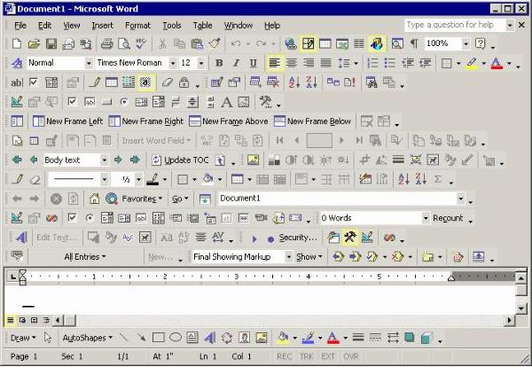
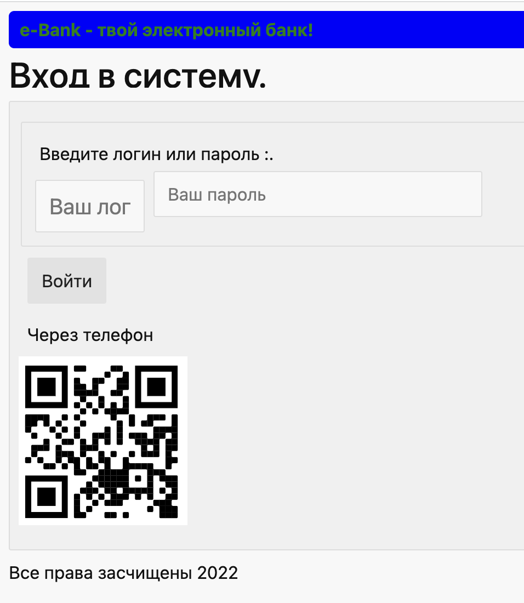
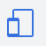

# Туториал: ломаем приложение онлайн-банка

Подойдет тем, кто хочет почувствовать себя в роли тестировщика ПО.

# 👍 Что сделаем

* Сломаем приложение онлайн-банка.
* Научимся находить **баги**.
* Поработаем с **инструментами разработчика** Chrome.
* Узнаем про **фронтенд**,  **бекенд**,  **куки**,  **API**,  **лог-файлы** и **SQL**.
* Выполним **SQL-запросы** в базу данных.
* Пополним свой **ИТ сленг** более чем 20 терминами.

# 🙋‍ Перед началом

* Вы уверенно пользуетесь компьютером.
* У Вас установлен браузер [Google Chrome](https://www.google.com/chrome/)
* У Вас открывается [тестовое приложение](https://qa.epic1h.com)
* У Вас установлены браузеры **Chrome** и **Opera**.
* У Вас закрыты **лишние вкладки** в браузере.
* У Вас закрыты **лишние программы** которые могут вас отвлекать, например мессенджеры.

Есть вопросы? Пишите в канал поддержки [support](https://chat.epic1h.com/channel/support)

# 🔢 Шаги

## Коротко о тестировании 😂 

> Тестировщик проводит краш-тесты программных продуктов.
>
> Тестировщик должен **уничтожить** продукт быстрее, чем его **уничтожит** пользователь.


*****

## 1. Ищем 🐞 баги на форме входа

### ✅ Грамматика

> Тестировщик — проверяет **грамматику** и **пунктуацию**.
>
> * Нет ли ошибок в тексте?
> * Все знаки препинания расставлены правильно?
> * Все ли сообщения понятны пользователю?

- [ ] Открой в браузере **Веб-приложение** онлайн-банка https://qa.epic1h.com/

<details>
  <summary>Находим ошибки в текстах на форме</summary>

* 🐞 Ошибка в слове, правильно — **защищены**
* 🐞 Ошибка в сообщении, правильно — **Введите логин и пароль**
* 🐞 В заголовках не ставятся точки в конце, правильно — **Вход в систему**
* 🐞 Пробел перед и точка после **:** в предложении, правильно — **Введите логин и пароль:**

</details>

*****

### ✅ Красота и аккуратность

> Тестировщик — проверяет **красоту и аккуратность**.
>
> * Визуально интерфейс выглядит приятно?
> * Размеры элементов, шрифты, сочетание цветов?

- [ ] Включи **педанта** и найди некрасивости на форме.

<details>
  <summary>Некрасивости 🤮</summary>

* 🐞 Заголовок **Вход в систему** обрезан снизу.
* 🐞 Поле **пароль** смещено наверх.
* 🐞 Размер шрифта полей **Логин** и **Пароль** разный.
* 🐞 Ширина поля **Логин** не вмещает вспомогательный текст.
* 🐞 Зеленый шрифт на синем фоне? Реально? Кровь из глаз 😂

</details>

Ну как уже много багов? А мы ведь только начали.

<details>
  <summary>Как развивать чувство вкуса?</summary>

* Наслаждайся прекрасным дизайном приложений на [Dribble](https://dribbble.com/search/app-design)
* Установи и изучи топовые приложения в [Apple App Store](https://developer.apple.com/design/awards/)

</details>

*****

### ✅ Удобство и простота использования

> Тестировщик — проверяет [юзабилити](https://ru.wikipedia.org/wiki/Юзабилити)
>
> * Насколько удобно взаимодействовать с интерфейсом?
> * Все кнопки нажимаются?
> * Все данные в поля ввода вводятся?
> * Понятно, что делает программа сейчас?

- [ ] Попробуй войти с логином и паролем **test**.
- [ ] Нажми на кнопку **Войти** быстро 2 раза подряд.

<details>
  <summary>Что не удобно на форме</summary>

* 🐞 После неудачного входа поле **логин** очищается.
* 🐞 Выводится сообщение на английском **Wrong password**
* 🐞 Сообщение об ошибке показывается 2 раза
* 🐞 Не отражается **прогресс**  входа

</details>

<details>
  <summary>Лучший интерфейс в мире 😂</summary>

  

</details>

*****

### ✅ Безопасность

> Тестировщик — проверяет **безопасность**
>
> * Программа не компрометирует пользователя?
> * Не причиняет боль, не травмирует?

- [ ] Что не безопасно 🤕 на форме?

<details>
  <summary>Не безопасно</summary>

🐞 Поле **пароль** не скрывает символы.

</details>

*****

### ✅ Совместимость

> Тестировщик — проверяет **совместимость**
>
> * Как программа работает в разных браузерах?
> * На разных устройствах: ноутбуке, смартфоне, планшете?
> * На разных операционных системах?
> * С разной скоростью Интернета?

- [ ] Открой **Web-приложение** https://qa.epic1h.com/ в браузере **Opera**

❓ Что сломалось на форме?

<details>
  <summary>Сломалось</summary>

🐞 Поле **пароль** не отображается. Как теперь вообще войти в приложение?

</details>

*****

- [ ] Отсканируй **QR-код** и открой приложение на телефоне.

❓ Что сломалось на форме?

<details>
  <summary>Сломалось</summary>

* 🐞 Форма **обрезает** поле ввода **пароля**
* 🐞 Что за **красная рамка** вокруг формы? Кровь из глаз 😂

</details>

Мы протестировали только одну форму входа и везде 🐞 Ох, уж эти программисты! Бездельники 😡

*****

### **Релиз** 🚀 новой версии

Мы отправили разработчикам список багов 🐞, они их исправили и выпустили версию `1.1`

- [ ] Откройте обновленное приложение по ссылке https://qa.epic1h.com/?v=1.1
- [ ] Проверьте исправления.

## Что было 👎



## Что стало 👍

* Заголовок **Вход в систему** не содержит точки в конце.
* Сообщение **Введите логин и пароль:** выглядит корректно.
* Ошибка в слове **защищенны** исправлена.
* Заголовок **Вход в систему** не обрезан снизу.
* Поле **пароль** не смещено наверх.
* Размер шрифта полей **Логин** и **Пароль** одинаковый.
* Ширина поля **Логин** вмещает вспомогательный текст.
* Дизайн приветствия **iBank - твой электронный банк!** исправлено.
* После неудачного входа поле **логин** сохраняется.
* Выводится сообщение на русском **Не верный пароль**
* Сообщение об ошибке показывается только 1 раз.
* Отражается **прогресс** входа.
* Кнопку **Войти** нельзя нажать несколько раз подряд.
* Поле **пароль** корректно отражает `*` вместо символов.
* В **Opera** поле **пароль** отображается корректно.
* На смартфоне форма выглядит корректно.

## 2. Используем **Инструменты разработчика**

> Тестировщик — понимает как разрабатываются программы и как они работают на устройствах.
>
> Тогда он сможет находить в них **ошибки!**

В окне нашего приложения:
- [ ] Нажми правой кнопкой мышки.
- [ ] Выбери из меню **просмотр кода элемента**.

Ты видишь [Инструменты разработчика Chrome](https://www.youtube.com/watch?v=FStLGMPHSEI)

### Элементы пользовательского интерфейса

> С помощью тегов **HTML** и стилей **CSS** рисуется пользовательский интерфейс.

На вкладке **элементы:**
- [ ] Раскрой тег `<form>`
- [ ] Наведи на тег `<button type="submit">`
- [ ] Нажми кнопку на клавиатуре **delete**

❓ Кто удалил кнопку из приложения? И как теперь работать?

> Перезагрузка страницы перезапускает приложение в браузере.

### Панель устройств

Активируй **панель устройств** 

- [ ] Попробуй выбрать различные типы устройств.
- [ ] Поменяй масштаб и ориентацию.

> **Важно** 
> 
> Это не полноценный эмулятор устройств, а только тест размера экрана.

### Консоль сообщений

- [ ] Перейди на вкладку **консоль**.
- [ ] Введи логин и пароль **test** и нажми **войти**.

❓ Что видишь в консоли?

```text
фронтенд загружен
запрос на бекенд GET /api/users/summary
ответ сервера: {count: 3}
запрос на бекенд POST /api/login {username: 'test', password: 'test'}
POST http://localhost:3000/api/login → 404
Пользователь не найден
```

<details>
  <summary>Кто такой Фронтенд и Бекенд? 😂</summary>

  

</details>

#### Что делает **Фронтенд**

* Рисует пользователю красивый и удобный интерфейс.
* Загружает данные с бекенда, оформляет и показывает их пользователю.
* Взаимодействует с пользователем.
* Собирает данные от пользователя и отправляет их на бекенд.

#### Что делает **Бекенд**

* Загружает данные из **БД** и передает **фронтенду**.
* Обрабатывает данные от фронтенда и записывает их в **БД**.
* Проверят права доступа к данным в **БД** для пользователя.
* Отправляет **email-ы** пользователям.

- [ ] Найди в консоли ошибку `Uncaught TypeError: final is not a function`?
- [ ] Переведи сообщение на русский.

❓ Это тоже баг?

*****

### Работа с сетью

- [ ] Откройте вкладку **Сеть** и найдите запрос на сервер `/api/login` и его ответ.

*****

## 3. Делаем **SQL** запросы

Бекенд разработчики предоставили нам для целей тестирования доступ в **Базу данных** на сервере.

- [ ] В новой вкладке открой https://qa.epic1h.com/db.html
- [ ] Нажмите кнопку **Выполнить**.

❓ Что выводится на экране?

- [ ] Откройте консоль и посмотри, что ответил **Бекенд**.
- [ ] Найди запрос на вкладке **Сеть**, и проверь ответ там.

Бинго 🥳 У нас есть логины и пароли.

- [ ] Переведи запрос `SELECT id, username, password, balance FROM users` на русский.

*****

## 4. Входим в приложение банка

- [ ] Вернись на вкладку с формой входа и вводим логин **chester** и пароль **1223456**

Ты видишь простое приложение банка с **фичей** перевода денег от одного человека к другому.

> **Инсайт**
> 
> Тестировщик — это этичный хакер!

- [ ] Найдите в этой функции баги 🐞

<details>
  <summary>Что делать?</summary>
  <p></p>

* Переведи от **chester** к **bob** 100 рублей.
* Выйди из **chester**, зайди под **bob** и проверь баланс.
* Попробуй перевести 0 рублей.
* Попробуй перевести -100 рублей.
* Попробуй переводить деньги от разных пользователей.

</details>

- [ ] Выполни **SQL** запрос `SELECT id, sender, recipient, amount FROM transactions`

❓ Что ты видишь?

- [ ] Переведи запрос на русский.

<details>
  <summary>Все баги нашел? 😂</summary>
  <p></p>

* 🐞 Можно переводить деньги самому себе.
* 🐞 Можно переводить 0 рублей.
* 🐞 Можно переводить отрицательное кол-во рублей.
* 🐞 Можно отправить **0.000001** рублей.
* 🐞 При переводе денег **marry** деньги поступают **bob**.
* 🐞 После отправки денег баланс текущего пользователя на форме не обновляется.
</details>

- [ ] Найди **некрасивости** и **неудобства** в интерфейсе.

## 5. Смотрим **логи** на сервере

Разработчики для целей тестирования предоставили доступ к **логу** программы на **Сервере**.

- [ ] Открой в новой вкладке https://qa.epic1h.com/server.log
- [ ] Переведи на русский язык записи из лога.

❓ Есть там залогированные баги? Что в этом логе опасного?

## 6. Хакнем базу

🙀 Разработчики не подумали и разместили файл базы данных в публичной части сервера!

- [ ] Скачай файл базы https://qa.epic1h.com/db.sql

❓ Это критический баг? Почему?

- [ ] Воспользуйся **Тулзой**  [SQL Light Viewer](https://inloop.github.io/sqlite-viewer/) для просмотра содержимого файла базы.

❓ Какие там таблицы и поля? За что они отвечают?

## 7. Сессия пользователя и **Печеньки**

В приложении есть еще один **большооой** баг.

🐞 Кнопка выход не работает на самом деле, сессия пользователя не закрывается.

- [ ] Зайди под **chester**, нажмите **Выход** и потом кнопку **назад** в браузере.

❗ Ты все еще **авторизован** под chester!

### Сессия пользователя

❓ Как **Бекенд** понимает, что запрос ему делает **chester**, а не **bob** например?

- [ ] Зайди в **Инструментах разработчика** в **Приложение** &rarr; **Cookies**. 
- [ ] Найди **печеньку** с именем `session`.
- [ ] Скопируй свое значение, например `xxx`
- [ ] Выполни запрос `SELECT * FROM sessions WHERE id = 'xxx'`

> Не забудьте вместо `xxx` записать свое значение сессии!

- [ ] Переведи запрос на русский.

* ❓ Кому принадлежит эта сессия? Она активна?
* ❓ Что должен записать сервер в таблицу `session` когда пользователь выходит?
* ❓ А где баг на **Фронте** или на **Беке**? Запрос на сервер вообще уходит?

### Сессия исправлена

- [ ] Открой новый релиз в новой вкладке https://qa.epic1h.com/dashboard.html?v=1.1
- [ ] Открой инструменты разработчика.
- [ ] Нажми на ссылку **Выход**.

* ❓ Запрос на сервер теперь уходит? На какой адрес?
* ❓ Куки `session` удалилась?

- [ ] Выполни запрос еще раз `SELECT * FROM sessions WHERE id = 'xxx'`

* ❓ Сессия теперь активна в базе данных?

# 🤩 Хочу еще

- [ ] Повтори туториал еще раз сам. Оставь вопросы к конкретным пунктам. 
- [ ] Задай вопросы в [сообществе](https://chat.epic1h.com/channel/qa_lean)
- [ ] Попробуй найти баги в приложении **Сбербанк Онлайн** в браузере. 
- [ ] Составь баг-лист и поделитесь в сообществе.

# Словарь

* **[HTML](https://ru.wikipedia.org/wiki/HTML)** — язык разметки гипер-текста.
* **[CSS](https://ru.wikipedia.org/wiki/CSS)** — язык оформления гипер-текста.
* **UI / User Interface / [Интерфейс пользователя](https://ru.wikipedia.org/wiki/Интерфейс_пользователя)** — как выглядит интерфейс программы.
* **UX / User Experience / [Опыт взаимодействия](https://ru.wikipedia.org/wiki/Опыт_взаимодействия)** — как взаимодействует пользователь с программой.
* **[Юзабилити](https://ru.wikipedia.org/wiki/Юзабилити) / Usability** — насколько удобен интерфейс программы.
* **Веб-сайт / Web-site** — набор HTML страничек для чтения пользователем через Интернет.
* **Веб-приложение / Web-app / Web-application** — программа для предоставления сервиса пользователю через Интернет.
* **Сервер / Server** — компьютер который **отдает** информацию в Интернет (в сеть).
* **Клиент / Client** — компьютер который **получает** информацию из Интернета (из сети).
* **Веб-сервер / Web-server** — программа на **сервере** для **обработки** запросов от **браузера**.
* **Браузер / Browser** — программа на **клиенте** для **отправки** запросов **веб-серверу**.
* **Фронтенд / Front-end** — часть программы нашего приложения запущенная на **веб-сервере**
* **Бекенд / Back-end** — часть программы нашего приложения запущенная в **браузере**.
* **Лог / Log** — журнал выполнения программы.
* **Баг / Bug** — ошибка в программе.
* **Фича / Feature** — функция в программе.
* **Релиз / Release** — выпуск новой версии программы.
* **БД / DB / Data Base** — база данных.
* **SQL** — язык запросов в базу данных.
* **Cookies / Куки** — данные сессии пользователя в **браузере** с **бекендом**.
* **Тулза / Tool** — полезная программа.

# Артефакты

* Быстро про **HTML** и **CSS**
* [TOP распространных паролей](https://www.cnbc.com/2022/02/27/most-common-passwords-hackers-leak-on-the-dark-web-lookout-report.html)

# Вопросы на собеседованиях

❓ Чем отличаются кэш и куки? И зачем очищать кэш?

<details>
  <summary>Ответ мастера</summary>

> **Кэш (cache) браузера** — это хранилище посещённых пользователем [веб-страниц](https://ru.wikipedia.org/wiki/Веб-страница).
>
> Кэш включает в себя ресурсы: **HTML**, **CSS**, **Java Script**, картинки, аудио и видео файлы и т.д.
>
> Браузер загружает файлы из кэша, что бы ускорить скорость повторной загрузки посещённых веб-страниц и их ресурсов.
>
> При наличии кэша браузер возьмет файлы локально, без повторной загрузки с сервера.
>
> **Куки** — данные текущей сессии пользователя которые передаются веб-серверу в каждом HTTP запросе.
>
> **Кэш** — это файлы веб-ресурсов, **куки** — это данные сессии пользователя.
>
> Если разработчики на веб-сервере неверно настроили управление кэшом для Браузера, то может возникнуть проблема, когда на сервере страница или ее ресурсы обновятся, а браузер продолжает использовать старую версию из кэша.
>
> **В этом случае нужно чистить кэш.**
>
> Где посмотреть или очистить **кэш**? 
>
> Откройте веб-сайт, далее **Инструменты разработчика** &rarr; **Приложение** &rarr; **Хранилище**
</details>

❓ Как можно использовать вкладку **Network** в **DevTools** для тестирования?

❓ Какие цели преследует тестирование?

❓ Можно ли начать тестирование, если разработчик еще не сделал фичу?
