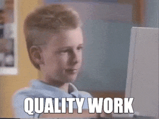

Мастер-класс: Организуем баг-трекинг в стартапе

Мастер-класс подойдет тем, что хочет научиться доставлять баги разработчикам и организовывать работу по их исправлению.

# Что сделаем

* Научимся красиво оформлять баг-репорты в **Markdown**.
* Организуем **баг-трекинг** в стартапе.
* Напишем более 10 **баг-репортов** разработчикам.

# 🙋‍️ Перед началом

* У Вас установлен браузер [Google Chrome](https://www.google.com/chrome/)
* У Вас открывается [тестовое приложение](https://qa.epic1h.com)
* У Вас установлено приложение для создания скриншотов и записи экрана или установите [Awesome Screenshot](https://www.awesomescreenshot.com)
* У Вас есть аккаунт в **Таск-трекере** [Trello](https://trello.com/)
* Прочитайте введение в [Markdown](https://ru.markdown.net.br/nachinaya/)

**Предварительно заполните своими данными:**
* **Устройство:** MacBook M1 Pro (14-inch, 2021) / 32 GB RAM
* **ОС:** macOS Monterey version: 12.0.1
* **Экран:** Built-in Liquid Retina XDR Display 3024x1964
* **Браузер:** Google Chrome 100.0.4896.88 (Official Build) (arm64)
* **Параметры сети:** 90.187.49.33, 100MB, Vodafone Germany

# 🔢 Шаги

Вас взяли **QA стажером** в стартап в котором разрабатывают инновационный платежный сервис **iBank**

На текущий момент тестирование проводилось разработчиками самостоятельно.

**Ваша цель:** организовать процессы тестирования **Веб-приложения iBank**

## 1. Узнаем про баг-репорт

Открой в **Chrome** веб-приложение **iBank** https://qa.epic1h.com/

**Найди баги из баг-листа 👇**
* 🐞 [Ошибка в слове засчищены](https://tinyurl.com/yxkduuxy)
* 🐞 [Поле ввода пароль не скрывает введенные символы](https://www.awesomescreenshot.com/video/9015550?key=6d7d2d74c1c3481ea13797fed3845ee2)

**Баг-лист** — это список ошибок со ссылками на снимки или записи экрана.

*****

**Как можно сообщить разработчикам о данных ошибках:**
* Подойти и сказать словами.
* Написать сообщение в чате.
* Позвонить по телефону.
* Оставить записку на столе.
* Попросить маму передать информацию.

**Вопрос: да или нет?**

*****

**Нет! Нет! Пожалуйста, нет!**

*****

**В баг-репорте — да!️**

**Баг-репорт** — отчет о несоответствии фактической работы (функционирования) программы и изначальных запланированных требований описанных в техническом задании на программу.

**От себя я бы еще добавил:** а так же, несоответствии работы программы общепринятым лучшим отраслевым практикам.

> В техническом задании например, может быть не написано, что все поля ввода пароля должны скрывать введенный текст звездочками, что бы не компрометировать пользователя.
> Но это не значит, что разработчик не должен этого сделать в программе.

**Баг** — это дефект, ошибка, проблема описанная в **бег-репорте** которая должна быть исправлена.

Что бы исправить ошибку хороший **баг-репорт** должен позволить:
* Понять суть проблемы и ее важность.
* Воспроизвести проблему.

*****

### Аттрибуты хорошего баг-репорта 😎

* одна ошибка — один репорт — **атомарность**
* шаги для обнаружения бага сможет повторить ваша бабушка — **воспроизводимость**
* лучше написать больше, чем потом утонуть в уточнениях (время) с разработчиком — **полнота**
* не писать лишнего — **лаконичность**
* профессиональное оформление и лучшие практики — **красота**
* разработчик должен «кайфануть» от бага — **эмпатия**

*****

## 2. Первый баг-репорт

Откройте **Markdown** редактор https://markdownlivepreview.com/ и скопируйте в него исходное содержимое [шаблон баг-репорта](https://raw.githubusercontent.com/breslavsky/hello-cypress/main/artefacts/bug_report.md)

**Markdown** — язык разметки текста — **must have** для ИТ индустрии!

На нем пишется документация, оформляются **Wiki** базы знаний, файлы **README**, описание задач и т.д.

**Markdown** содержит специальный синтаксис для оформления:
* заголовков,
* параграфов,
* списков,
* примеров кода,
* вставки картинок
* и т.д.

*****

Проанализируй содержание и все разделы баг репорта.

*****

Удалите в разметке **баг-репорта** теги `
 ... 
` и их содержимое в редакторе.

<timer time="03:00">
    
</timer>

*****

## 3. Организуем **Баг-трекер**

### Настройка **Канбан-доски**

Откройте **таск-трекер** [Trello](https://trello.com) и создайте новую канбан-доску **iBank**

Создайте списки: **Баг найден**, **Баг исправляется**, **Баг исправлен**, **Баг отклонен**, **Баг исправлен и проверен**

<timer time="05:00">
    
</timer>

*****

### Карточка бага и разработчик

Создайте новую карточку **Ошибка в слове засчищены** и скопируйте содержимое **баг-репорта** в описание карточки.

<timer time="01:00">
    
</timer>

*****

Добавьте лейбл зеленого цвета для приоритета **низкий**

<timer time="01:00">
    
</timer>

*****

Пригласите разработчика **breslavky.anton@gmail.com** на вашу доску и назначьте ему данный билет.

Ожидайте перемещение карточки в список **Баг исправлен**

*****

### Проверка исправления

Найдите в комментарии к билету ссылку на исправленную версию приложения.

   
Комментарий разработчика

Спасибо за отличный баг ❤️

Держи ссылку на релиз с исправлением https://qa.epic1h.com/?v=1.1

<timer time="01:00">
    
</timer>

*****

Переместите билет в состояние **Баг исправлен и проверен**

Не забудьте сказать разработчику в комментариях спасибо ❤️

В каком случае билет может быть перемещен в список **Баг отклонен**?

*****

## 4. Баг-репорт на поле ввода пароля

Отредактируйте баг-репорт в редакторе для бага 🐞 [Поле ввода **пароль** не скрывает введенные символы](https://www.awesomescreenshot.com/video/9015550?key=6d7d2d74c1c3481ea13797fed3845ee2)

*****

Создайте новую карточку в Trello для бага.

   
Баг-репорт на поле ввода пароля

* **Номер**: 2
* **Наименование**: Поле ввода пароль не скрывает введенные символы
* **Тип:** Ошибка безопасности
* **Серьезность:** 🟢 незначительная
* **Приоритет:** 🔴 высокий

**Шаги для воспроизведения**

1. Открыть главную страницу iBank `/`
1. Ввести в поле пароль: 123456

**Фактический результат**

Пользователь видит введенный им пароль.

**Ожидаемый результат**

Пользователь видит вместо символов пароля `*`

**Мотивация**

**Лучшая практика:** интерфейс программы не должен компрометировать пользователя.

# 🤩 Что дальше?

Создай в Трелло отдельную задачу: Тестирование приложения iBank

В качестве описания добавь баг-лист:
1. 🐞 Ошибка в заголовке вход в систему

   
Где?

В заголовках не ставятся точки в конце, правильно — **Вход в систему**

2. 🐞 Ошибка в сообщении введите логин или пароль

   
Где?

Правильно — **Введите логин и пароль**

3. 🐞 Заголовок вход в систему обрезан снизу
4. 🐞 Поле пароль смещено наверх
5. 🐞 Размер шрифта полей логин и пароль разный
6. 🐞 Ширина поля логин не вмещает вспомогательный текст
7. 🐞 Дизайн приветствия 
8. 🐞 После неудачного входа поле логин сохраняется
9. 🐞 Ошибка локализации сообщения при входе
10. 🐞 Сообщение об ошибке показывается только 2 раза
11. 🐞 Не отражается прогресс входа
12. 🐞 Кнопку войти нажимается несколько раз подряд
13. 🐞 Поле пароль не отображается в Opera
14. 🐞 На смартфоне форма входа обрезается

Найди ошибки, добавь скриншоты или записи экрана в Markdown для данного баг-листа.

Для каждой ошибки создай отдельную карточку и оформи баг-репорт.

Расставь приоритеты, и отсортируй карточки.

Сделай свою доску публичной и доступной по ссылке.

Отправите ссылку в канал `qa_feedback` с просьбой коллег из [сообщества](https://chat.epic1h.com/channel/qa_feedback) провести оценку своих баг-репортов.

> Уважаемые коллеги, прошу Вас провести ревью и дать обратную связь по составлению баг-репортов https://trello.com/...
> Заранее благодарю 🙏🏻

# Артефакты
1. [Шаблон баг-репорта](artefacts/bug_report.md)
2. [Идеальный баг-репорт](artefacts/perfect_bug_report.md)

# Читать и смотреть
1. [Баг и баг репорт](https://beqa.pro/blog/баг-и-баг-репорт)
2. [Правила написания предварительных шагов в тест-кейсах](https://habr.com/ru/post/481628/)
