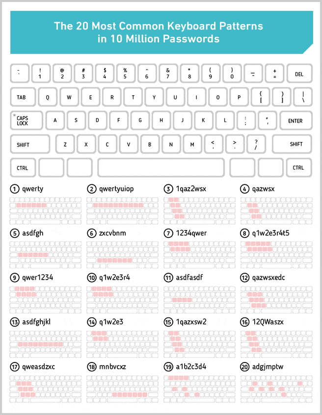

Мастер-класс: **пишем идеальные баг-репорты**

Подойдет тем, что хочет научиться описывать найденные **ошибки в ПО** и передавать их на **исправление** разработчикам в виде баг-репортов.

# Что сделаем

* Проведем исследование **критического бага**
* Напишем **идеальный баг-репорт**

Мастер-класс подойдет тем, кто хочет, научится писать идеальные баг-репорты разработчикам приложений.

# 🙋‍♂️ Перед началом

* У Вас установлен браузер `Chrome`
* У Вас открывается тестовое приложение https://qa.epic1h.com/
* У Вас есть приложение для записи экрана или установите https://www.awesomescreenshot.com/
* У Вас аккаунт в `Таск-трекере` https://trello.com/

Есть вопросы? Пишите в канал поддержки https://chat.epic1h.com/

# 🔢 Шаги


## 1. Оформляем баг-репорт

Откройте в `Chrome` https://qa.epic1h.com/?v=1.1 и попробуйте войти в личный кабинет пользователем `marry` с паролем `qwerty`

<details>
  <summary>Что такое qwerty 🤢?</summary>
  <p></p>



</details>

❗ После нажатия на кнопку `Войти` пользователю выдается сообщение `Критическая ошибка сервера`

Откройте `Markdown` редактор https://dillinger.io/ и скопируйте в него исходное содержимое [шаблона идеального баг-репорта](../artefacts/perfect_bug_report.md)

**Поправьте в репорте:**
* Дату обнаружения.
* Версию приложения.
* Окружение.

Вам помогут https://whatismybrowser.com/ и https://whatismyipaddress.com/

<timer time="03:00">
    
</timer>


## 2. Воспроизводим и исследуем баг

Сделайте запись экрана используя `Awesome Screenshot` и закрепите ссылку в отчет.

<timer time="02:00">
    
</timer>

Очистите результаты исследования в репорте и оставьте только заголовки.

<timer time="01:00">
    
</timer>

### Состояние до бага

Выполните предварительные условия:
* Откройте https://qa.epic1h.com/?v=1.1
* Сбросьте Cookie и кэш в Браузере: `Инструменты разработчика` &rarr; `Приложение` &rarr; `Хранилище` &rarr; `Очистить`

<timer time="01:00">
    
</timer>

Выполните шаги для воспроизведения бага.

Откройте главную страницу `/` iBank.

В разделе `Исследование` заполните подразделы `После загрузки страницы`

#### Консоль

В `Инструментах разработчика` перейдите на вкладку `Консоль`

Скопируйте содержимое консоли в раздел баг-репорта `6.1. Console пользователя`

> Не забывайте оформлять `Markdown`
> ~~~Markdown
> ```text
> Текст тут
> ```
> ~~~

<details>
  <summary>Что получилось</summary>
  <p></p>

~~~Markdown
```text
фронтенд загружен
запрос на бекенд GET /api/users/summary
ответ сервера: {count: 3}
Uncaught TypeError: final is not a function at XMLHttpRequest.request.onreadystatechange
```
~~~
</details>

#### Cookies

Перейдите на вкладку `Приложение` &rarr; `Cookies` и заполните в отчете `6.2. Cookie браузера`

Используйте [Markdown таблицы](https://www.tablesgenerator.com/markdown_tables) для оформления.

<details>
  <summary>Что получилось</summary>
  <p></p>

~~~Markdown
```markdown
| **name** | **value**           |
|----------|---------------------|
| rnd      | 0.22187308399860428 |
```
~~~
</details>

<timer time="00:30">
    
</timer>

#### Запросы к API

Перейдите на вкладку `Сеть` и выберите фильтр `Fetch/XHR`

Выберите запрос `/summary`, заполните `6.3. Log запросов к API` &rarr; `После загрузки страницы` 

Используйте вкладки `Заголовки`, `Ответ`, `Cookies` и шаблон

~~~Markdown
```text
{Request Method} {Request URL}
{Status Code} ↓ 
{Response}
```
~~~

<details>
  <summary>Что получилось</summary>
  <p></p>

~~~Markdown
```text
GET https://qa.ecpic1h.com/api/users/summary
200 ↓ 
{"count": 5}
```
~~~
</details>

<timer time="01:00">
    
</timer>

#### Состояние базы данных

Перейдите на https://qa.epic1h.com/db.html и выполните запрос

```sql
SELECT id, username, password, firstName FROM users WHERE username = 'marry'
```

Используйте [Markdown таблицы](https://www.tablesgenerator.com/markdown_tables) для оформления.

<details>
  <summary>Что получилось</summary>
  <p></p>

~~~Markdown
Пользователь с логином `marry` присутствует в базе данных.

```markdown
| **id** | **username** | **password** | **firstName** |
|--------|--------------|--------------|---------------|
| 3      | marry        | qwerty       | NULL          |
```
~~~
</details>

Проверьте что сессии для пользователя `marry` отсутствуют

```sql
SELECT * FROM sessions WHERE user = 3
```

<timer time="01:00">
    
</timer>

### Исследуем состояние после обнаружения бага

Выполните оставшиеся шаги для воспроизведения

2. На форме `Входа` заполнить поля:
    1. Логин: `marry`
    2. Пароль: `qwerty`
3. Нажать на кнопку `Войти`

#### Консоль

Скопируйте новые записи в раздел `После нажатия на кнопку Войти`

<details>
  <summary>Что получилось</summary>
  <p></p>

~~~Markdown
```text
запрос на бекенд POST /api/login {username: 'marry', password: 'qwerty'}
POST https://qa.epic1h.com/api/login 500 (Internal Server Error)
```
~~~
</details>

<timer time="01:00">
    
</timer>

#### Cookies

Заполните состояние Cookies.

<details>
  <summary>Что получилось</summary>
  <p></p>

Без изменений.
</details>

<timer time="00:30">
    
</timer>

#### Запросы к API

Опишите все запросы к API после фиксации бага.

<details>
  <summary>Что получилось</summary>
  <p></p>

~~~Markdown
### После нажатия на кнопку **Войти**
```
POST /api/login
{"login": "marry", "password": "qwerty"}
500 ↓
Не удалось создать сессию
```
~~~
</details>

<timer time="02:00">
    
</timer>

#### Состояние базы данных

Проверьте сессии для пользователя `marry` и добавьте в отчет.
```sql
SELECT * FROM sessions WHERE user = 3
```

<details>
  <summary>Что получилось</summary>
  <p></p>

~~~Markdown
Создана сессия для пользователя `marry`

`SELECT * FROM sessions WHERE user = 3`

| **id**    | **user** | **active** |
|-----------|----------|------------|
| eeSJFLKxt | 3        | 1          |
~~~
</details>

<timer time="02:00">
    
</timer>

#### Лог сервера

Откройте в новой вкладке о https://qa.epic1h.com/server.log

Добавьте в отчет информацию которую считаете ключевой.

<details>
  <summary>Что получилось</summary>
  <p></p>

~~~Markdown
```text
2022-05-01T12:18:46.792Z connected to database
2022-05-01T12:18:46.791Z server has been started
...
2022-05-01T12:18:49.049Z checking password qwerty === qwerty
2022-05-01T12:18:49.049Z finding username marry
2022-05-01T12:18:49.050Z TypeError: Cannot read property 'toUpperCase' of null
```
~~~
</details>

# Артефакты
1. [Баг и баг репорт](https://beqa.pro/blog/баг-и-баг-репорт)
2. [Правила написания предварительных шагов в тест-кейсах](https://habr.com/ru/post/481628/)
