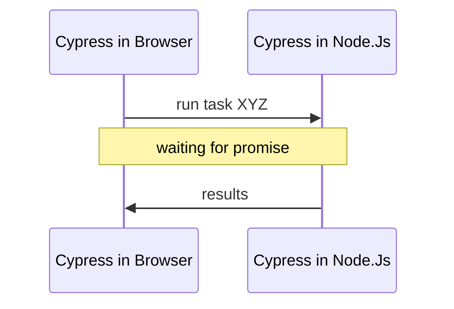

# Туториал: забавные кейсы

# 🙋‍ Перед началом

* Ты инициализировал чистый **Node.js** проект `%/projects/cypress/fun_cases`
* Ты установил Cypress `npm i cypress@9 --save-dev`
* Ты установил Tiny Web Server.
* Ты загрузил тестовое приложение в папку `~/apps`

```bash
npx wget -d apps/ https://raw.githubusercontent.com/breslavsky/hello-cypress/main/apps/fun-cases.html
```

# 🔢 Кейсы

## +1. Проверка QR кода

- [x] Установи нужные пакеты:

```bash
npm i --save-dev node-wget qr-util
```

- [x] Создай файл теста `fun-cases.spec.js` с содержимым:

```js
beforeEach(() => {
    cy.visit('http://localhost:3000/apps/fun-cases.html');
});

it.only('should do check QR code', () => {
    
    cy.get('section[data-cy=qr-code]').should('be.visible').as('section').scrollIntoView();

    cy.get('img').then(image => {
        const url = image.attr('src');
        cy.task('readQRCode', url).should('eq', 'https://demo.realworld.io/')
    });

});
```

- [x] Обнови файл `~/cypress/plugins/index.js`

```js
const wget = require('node-wget');
const fs = require('fs');
const path = require('path');
const { parseQR } = require('qr-util');

// creating temp folder
const TMP_FOLDER = 'tmp';
if (!fs.existsSync(TMP_FOLDER)) {
  fs.mkdirSync(TMP_FOLDER);
}
module.exports = (on, config) => {
  on('task', {
    readQRCode: (url) => {
      console.log('checking QR code from URL', url);
      return new Promise((done) => {
        const tmpFile = path.join(TMP_FOLDER, 'qr_code.png');
        wget({ url, dest: tmpFile }, () => {
          console.log('file downloaded to', tmpFile);
          const buffer = fs.readFileSync(tmpFile);
          parseQR(buffer)
            .then(content => {
              console.log('code contents', content);
              // TODO: remove tmp file in production
              // fs.unlinkSync(tmpFile);
              done(content);
            });
        });
      });
    }
  })
};
```

- [x] Проверь, что тест 🟢 проходит.
- [x] Открой консоль Cypress в Visual Code и найди вывод `console.log`
- [x] Повтори тест несколько раз.
- [x] Открой файл `~/tmp/qr_code.png`

* ❓ Что делает `wget`?
* ❓ Что делает  `parseQR`?
* ❓ Что такое `task`?

### Как это работает

> Cypress живет в двух разных окружениях: Node.Js и браузера.

1. Мы запускаем Cypress через Node.Js.
2. Cypress запускает Chrome и управляет им встраиваясь в DOM.

Код тестов внутри `it` запущенный в окружении браузера:
* Доступ к **DOM:** window, document, location, и т.д.
* Нет доступа к **файловой системе.**

Что бы получить доступ к файлам, необходимо **передать управление** Cypress внутри Node.Js через таски.
  


***

## +2. Медленный UI

<mark>Почему у меня в ручную тест проходит, а в Cypress ничего не работает!?</mark>

<iframe src="https://giphy.com/embed/d2lcHJTG5Tscg" 
  width="480" height="270" frameBorder="0" class="giphy-embed"></iframe>

> Cypress — это **машина** которая делает все в **100x раз быстрее** человека.

Пока ты будешь **скролить** и **двигать мышкой** Cypress:
* успеет приготовить кофе, 
* сбегать в супермаркет
* и покормить кота 🤣

> Задача тестов — выполняться быстро, Cypress нет смысла тормозить.

❗ Может получится, что **UI приложения** к такой скорости просто не готов.

### Что делать

* Всегда делай ассерты — `should`, что бы дождаться, что **UI готов** к взаимодействию.

Попроси у разработчиков добавить индикаторы:

```js
cy.get('body').should('have.class', 'ready');
cy.get('app-root').should('not.have.class', 'busy');
cy.get('input[name=cities]').should('have.class', 'loaded');
```

* Всегда **после действия** проверяй, что UI изменился как ожидалось.

```js
cy.get('form.login button[type=submit]').click();
cy.get('p.success').should('have.text', 'You logged!');
```

***

### Кейсы из жизни

Есть форма **заказа доставки** с полем — **дата доставки.**

В поле по умолчанию заполняется завтрашний день, но **через 2 секунды.**


</details>

Почему? Например, программисту требуется с бекенда загрузить список всех доступных дат.

В тесте мы хотим установить дату доставки на **послезавтра.**

- [x] Добавь новый тест:

```js
it.only('should do book delivery', () => {
    
    cy.get('section[data-cy=slow-ui]').should('be.visible').as('section');

    cy.get('@section')
        .find('button[data-cy=start-booking]')
        .click();

    cy.get('@section')
        .find('form[name=booking]')
        .should('be.visible').as('bookingForm');

    const today = new Date();
    const afterTomorrow = new Date();
    afterTomorrow.setDate(today.getDate() + 2);

    const targetDate = afterTomorrow.toLocaleDateString('en-US');

    cy.get('@bookingForm')
        .find('input[name=target_date]')
        .clear()
        .type(targetDate);

    cy.get('@bookingForm')
        .find('button[data-cy=submit]')
        .click();

    cy.get('@bookingForm')
        .find('p.success')
        .should('be.visible')
        .should('contain.text', targetDate);
});
```

- [x] Проверь, что тест 🔴 провален.
- [x] Проинспектируй HTML код кнопки и функцию `startBooking()`

* ❓ Почему тест не проходит?

***

- [x] Обнови код теста:

```diff
      const targetDate = afterTomorrow.toLocaleDateString('en-US');
+     cy.get('@bookingForm')
+         .should('not.have.class', 'busy');
```

* ❓ Почему теперь тест 🟢 проходит?

### Отладка теста

Как я узнал про магию `should('not.have.class', 'busy')`?

- [x] Обнови код теста:

```diff
-     cy.get('@bookingForm').should('not.have.class', 'busy');
+     cy.wrap(null).then(() => {
+       cy.pause();
+       debugger; 
+     });
```

- [x] Открой инструменты разработчика в Cypress.

Не благодари, посмотри видео как я сэкономил тебе кучу времени в будущем.

