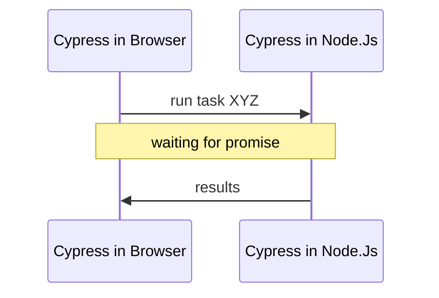

# Туториал: забавные кейсы

# 🙋‍ Перед началом

* Ты инициализировал чистый **Node.js** проект `%/projects/cypress/fun_cases`
* Ты установил Cypress `npm i cypress@9 --save-dev`
* Ты установил Tiny Web Server.
* Ты загрузил тестовое приложение в папку `~/apps`

```bash
npx wget -d apps/ https://raw.githubusercontent.com/breslavsky/hello-cypress/main/apps/fun-cases.html
```

# 🔢 Кейсы

## +1. Проверка QR кода

- [x] Установи нужные пакеты:

```bash
npm i --save-dev node-wget qr-util
```

- [x] Создай файл теста `fun-cases.spec.js` с содержимым:

```js
beforeEach(() => {
    cy.visit('http://localhost:3000/apps/fun-cases.html');
});

it.only('should do check QR code', () => {
    
    cy.get('section[data-cy=qr-code]').should('be.visible').as('section').scrollIntoView();

    cy.get('img').then(image => {
        const url = image.attr('src');
        cy.task('readQRCode', url).should('eq', 'https://demo.realworld.io/')
    });

});
```

- [x] Обнови файл `~/cypress/plugins/index.js`

```js
const wget = require('node-wget');
const fs = require('fs');
const path = require('path');
const { parseQR } = require('qr-util');

// creating temp folder
const TMP_FOLDER = 'tmp';
if (!fs.existsSync(TMP_FOLDER)) {
  fs.mkdirSync(TMP_FOLDER);
}
module.exports = (on, config) => {
  on('task', {
    readQRCode: (url) => {
      console.log('checking QR code from URL', url);
      return new Promise((done) => {
        const tmpFile = path.join(TMP_FOLDER, 'qr_code.png');
        wget({ url, dest: tmpFile }, () => {
          console.log('file downloaded to', tmpFile);
          const buffer = fs.readFileSync(tmpFile);
          parseQR(buffer)
            .then(content => {
              console.log('code contents', content);
              // TODO: remove tmp file in production
              // fs.unlinkSync(tmpFile);
              done(content);
            });
        });
      });
    }
  })
};
```

- [x] Проверь, что тест 🟢 проходит.
- [x] Открой консоль Cypress в Visual Code и найди вывод `console.log`
- [x] Повтори тест несколько раз.
- [x] Открой файл `~/tmp/qr_code.png`

* ❓ Что делает `wget`?
* ❓ Что делает  `parseQR`?
* ❓ Что такое `task`?

### Как это работает

> Cypress живет в двух разных окружениях: Node.Js и браузера.

1. Мы запускаем Cypress через Node.Js.
2. Cypress запускает Chrome и управляет им встраиваясь в DOM.

Код тестов внутри `it` запущенный в окружении браузера:
* Доступ к **DOM:** window, document, location, и т.д.
* Нет доступа к **файловой системе.**

Что бы получить доступ к файлам, необходимо **передать управление** Cypress внутри Node.Js через таски.
  


***

## +2. Медленный UI

Очень частый вопрос

Почему у меня в ручную тест проходит, а в Cypress ничего не работает!!!

Причины:

Cypress это машина которая делает все в 100x раз быстрее человека.

В то время, когда вы, как человек будете скролить и двигать мышкой до нужной кнопки Cypress уже успеет приготовить кофе, сбегать в супермаркет и покормить кота.

Задача тестов как можно быстрее выполняться, Cypress нет смысла специально тормозить свою работу.

И может так получится, что UI приложения к такой скорости просто не готов.

> Всегда делайте ассерты — `should`, что бы дождаться, что UI готов к взаимодействию.
> Всегда после взаимодействия делайте ассерты, что бы проверить, что действие выполнилось как ожидалось.

