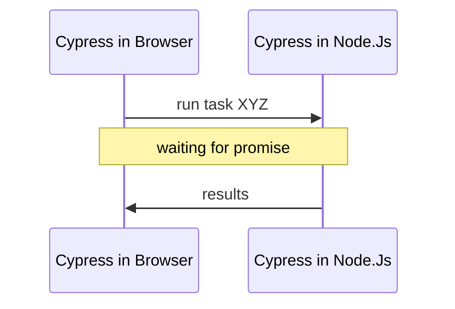

<md-hidden>
🛑 Данный туториал отображается на GitHub 🔴 не корректно! Это лишь исходник.<br>
Правильная версия https://www.epic1h.com/fun_cases_in_cypress
</md-hidden>

# Туториал: забавные кейсы

Подойдет тем, кто хочет познакомится с кейсам из жизни авто-тестировщика на Сypress.

# 👍 Что сделаем

* Научимся тестировать QR коды на Cypress.
* Научимся делать отладку приложения и тестов.
* Научимся перехватывать ошибки на сайте.

# 🙋‍ Перед началом

* Ты инициализировал чистый **Node.js** проект `%/projects/cypress/fun_cases`
* Ты установил Cypress `npm i cypress@9 --save-dev`
* Ты установил Tiny Web Server и Wget `npm i tiny-server node-wget --save-dev`
* Ты загрузил тестовое приложение в папку `~/apps`

```bash
npx wget -d apps/ https://raw.githubusercontent.com/open-tutorials/cypress/main/apps/fun-cases.html
```

Если забыл, глянь в наш [второй туториал](https://www.epic1h.com/best_selectors#1-подготовка-веб-сервера)

# 🔢 Кейсы

## +1. Проверка QR кода

- [x] Установи нужные пакеты:

```bash
npm i qr-util --save-dev
```

- [x] Создай файл теста `fun-cases.spec.js` с содержимым:

```js
beforeEach(() => {
    cy.visit('http://localhost:3000/apps/fun-cases.html');
});

it.only('should do check QR code', () => {
    
    cy.get('section[data-cy=qr-code]').should('be.visible').as('section').scrollIntoView();

    cy.get('img').then(image => {
        const url = image.attr('src');
        cy.task('readQRCode', url).should('eq', 'https://demo.realworld.io/')
    });

});
```

- [x] Обнови файл `~/cypress/plugins/index.js`

```js
const wget = require('node-wget');
const fs = require('fs');
const path = require('path');
const { parseQR } = require('qr-util');

// creating temp folder
const TMP_FOLDER = 'tmp';
if (!fs.existsSync(TMP_FOLDER)) {
  fs.mkdirSync(TMP_FOLDER);
}
module.exports = (on, config) => {
  on('task', {
    readQRCode: (url) => {
      console.log('checking QR code from URL', url);
      return new Promise((done) => {
        const tmpFile = path.join(TMP_FOLDER, 'qr_code.png');
        wget({ url, dest: tmpFile }, () => {
          console.log('file downloaded to', tmpFile);
          const buffer = fs.readFileSync(tmpFile);
          parseQR(buffer)
            .then(content => {
              console.log('code contents', content);
              // TODO: remove tmp file in production
              // fs.unlinkSync(tmpFile);
              done(content);
            });
        });
      });
    }
  })
};
```

- [x] Проверь, что тест 🟢 проходит.
- [x] Открой консоль Cypress в Visual Code и найди вывод `console.log`
- [x] Повтори тест несколько раз.
- [x] Открой файл `~/tmp/qr_code.png`

* ❓ Что делает `wget`?
* ❓ Что делает  `parseQR`?
* ❓ Что такое `task`?

### Как это работает

> Cypress живет в двух разных окружениях: Node.Js и браузера.

1. Мы запускаем Cypress через Node.Js.
2. Cypress запускает Chrome и управляет им встраиваясь в DOM.

Код тестов внутри `it` запущенный в окружении браузера:
* Доступ к **DOM:** window, document, location, и т.д.
* Нет доступа к **файловой системе.**

Что бы получить доступ к файлам, необходимо **передать управление** Cypress внутри Node.Js через таски.
  


***

## +2. Медленный UI

<mark>Почему у меня в ручную тест проходит, а в Cypress ничего не работает!?</mark>

<iframe src="https://giphy.com/embed/d2lcHJTG5Tscg" 
  width="480" height="270" frameBorder="0" class="giphy-embed"></iframe>

> Cypress — это **машина** которая делает все в **100x раз быстрее** человека.

Пока ты будешь **скролить** и **двигать мышкой** Cypress:
* успеет приготовить кофе, 
* сбегать в супермаркет
* и покормить кота 🤣

> Задача тестов — выполняться быстро, Cypress нет смысла тормозить.

❗ Может получится, что **UI приложения** к такой скорости просто не готов.

### Что делать

> Всегда делай ассерты — `should`, что бы дождаться, что **UI готов** к взаимодействию.

Попроси у разработчиков добавить индикаторы:

```js
cy.get('body').should('have.class', 'ready');
cy.get('app-root').should('not.have.class', 'busy');
cy.get('input[name=cities]').should('have.class', 'loaded');
```

❗ Всегда **после любого действия** проверяй, что UI изменился как ожидалось.

```js
cy.get('form.login button[type=submit]').click();
cy.get('p.success').should('have.text', 'You logged!');
```

***

### Кейсы из жизни

Есть форма **заказа доставки** с полем — **дата доставки.**

В поле по умолчанию заполняется завтрашний день, но **через 2 секунды.**


</details>

Почему? Например, программисту требуется с бекенда загрузить список всех доступных дат.

В тесте мы хотим установить дату доставки на **послезавтра.**

- [x] Добавь новый тест:

```js
it.only('should do book delivery', () => {
    
    cy.get('section[data-cy=slow-ui]').should('be.visible').as('section');

    cy.get('@section')
        .find('button[data-cy=start-booking]')
        .click();

    cy.get('@section')
        .find('form[name=booking]')
        .should('be.visible').as('bookingForm');

    const today = new Date();
    const afterTomorrow = new Date();
    afterTomorrow.setDate(today.getDate() + 2);

    const targetDate = afterTomorrow.toLocaleDateString('en-US');

    cy.get('@bookingForm')
        .find('input[name=target_date]')
        .clear()
        .type(targetDate);

    cy.get('@bookingForm')
        .find('button[data-cy=submit]')
        .click();

    cy.get('@bookingForm')
        .find('p.success')
        .should('be.visible')
        .should('contain.text', targetDate);
});
```

- [x] Проверь, что тест 🔴 провален.
- [x] Проинспектируй HTML код кнопки и функцию `startBooking()`

* ❓ Почему тест не проходит?

***

- [x] Обнови код теста:

```diff
      const targetDate = afterTomorrow.toLocaleDateString('en-US');
+     cy.get('@bookingForm')
+         .should('not.have.class', 'busy');
```

* ❓ Почему теперь тест 🟢 проходит?

### Отладка теста

Как я узнал про магию `should('not.have.class', 'busy')`?

- [x] Обнови код теста:

```diff
-     cy.get('@bookingForm').should('not.have.class', 'busy');
+     cy.wrap(null).then(() => {
+       cy.pause();
+       debugger; 
+     });
```

- [x] Открой инструменты разработчика в Cypress.

Не благодари, 📹 [посмотри видео](https://www.youtube.com/watch?v=ykY256drbkMc&t=2551) как я сэкономил тебе кучу времени в будущем.


## +3. Перехват ошибок на сайте

Бывает такое, что на самом сайте в коде есть ошибка, которая мешает нашему тесту успешно выполниться.

Что бы наш тест проходил, нужно перехватить эту ошибку.

- [x] Добавь в начало файла теста:

```js
// only for cypress.io
Cypress.on('uncaught:exception', () => false);
```

❓ Теперь тест проходит успешно?

📹 [Мое объяснение](https://www.youtube.com/watch?v=l6qbqBR_zZc&t=1829)

## +4. Проверка Excel файла

- [x] Установи пакет для работы с XLSX файлами для Node.Js

```bash
npm i node-xlsx --save-dev
```

- [x] Обнови файл `~/cypress/plugins/index.js`

```diff
+ const xlsx = require('node-xlsx');

  module.exports = (on, config) => {
    on('task', {
    
+     downloadFile: ([url, tmpFileName]) => {
+       return new Promise((done) => {
+         console.log('download file', url, tmpFileName);
+         const tmpFile = path.join(TMP_FOLDER, tmpFileName);
+         wget({ url, dest: tmpFile }, () => {
+           // TODO: Looks like a bug in wget. Waiting 1 sec. for closing file.
+           setTimeout(() => {
+             console.log('file downloaded to', tmpFile);
+             done(tmpFile);
+           }, 100);
+         });
+       });
+     },

+     waitFile: (file) => {
+       return new Promise((done) => {
+         console.log('looking file', file);
+         let attempts = 5;
+         const checkExists = () => {
+           if (!fs.existsSync(file)) {
+             if (--attempts > 0) {
+               setTimeout(checkExists, 1000);
+             } else {
+               throw new Error('File not found');
+             }
+           } else {
+             done(file);
+           }
+         };
+ 
+         checkExists();
+       });
+     },
+ 
+     xlsxToJson: (file) => {
+       return new Promise((done) => {
+         console.log('parse XLSX file to JSON', file);
+         done(xlsx.parse(file));
+       });
+     }
+ 
+   })
+ 
+ };
```

- [x] Добавь новые тесты:

```js
describe.only('Report in XLSX', () => {

    const REPORT_FILE_NAME = 'users_report.xlsx';

    beforeEach(() => {
        cy.get('section[data-cy=check-xlsx-report]')
            .should('be.visible').as('section');
    });

    function checkSpreadsheet() {

        cy.get('@spreadsheetInJson')
            .should('not.be.empty')
            .then(spreadsheet => {
                const [sheet1] = spreadsheet;
                expect(sheet1.name).be.eq('Users');
                const { data: rows } = sheet1;
                expect(rows).eql([
                    ['First Name', 'Last Name', 'Email'],
                    ['Elon', 'Musk', 'elon@gmail.com'],
                    ['Bill', 'Gates', 'bill@gmail.com']
                ]);
            });

    }

    it('should do check report by link', () => {

        cy.get('@section').find('a.download')
            .invoke('attr', 'href')
            .then(href => {
                cy.task('downloadFile', [href, REPORT_FILE_NAME])
                    .then(tmpFile => cy.task('xlsxToJson', tmpFile)
                        .as('spreadsheetInJson'));
            });

        checkSpreadsheet();
    });

    it('should do check report by button', () => {

        cy.window().then((window) => {
            cy.stub(window, 'open').callsFake((url) => {
                return url;
            }).as('replacedWindowOpen');
        });

        cy.get('@section').find('button').click();
        cy.get('@replacedWindowOpen').should('have.been.called')
            .its('returnValues.0')
            .then(url => {
                cy.task('downloadFile', [url, REPORT_FILE_NAME])
                    .then(tmpFile => cy.task('xlsxToJson', tmpFile)
                        .as('spreadsheetInJson'));
            });

        checkSpreadsheet();

    });

    it('should do check report by browser download', () => {

        cy.get('@section').find('a.download').click();

        cy.task('waitFile', 'cypress/downloads/users_report.xlsx')
            .then(tmpFile => cy.task('xlsxToJson', tmpFile)
                .as('spreadsheetInJson'));

        checkSpreadsheet();

    });

});
```

***

## +5. Регистрация с подтверждением email

При регистрации в системе на указанную почту отправляется специальный код или ссылка.

Основные способы:
* Использовать сервисы Disposable Email типа https://temp-mail.org/
* Добавить на бекенд для целей тестирования секреты.

### Подготовка сервера

- [x] Зарегистрируйся на сервисе [Mail Slurp](https://app.mailslurp.com/login/)
- [x] Создай файл тестового сервера `server.js` с [содержимым](/cypress_09/server.js)
- [x] Установи нужные пакеты:

```bash
npm i express dotenv mailslurp-client --save
npm i @faker-js/faker --save-dev
```

- [x] Скопируй **API KEY** из **Mail Slurp** в буфер.
- [x] Перейди Mail Slurp &rarr; Inboxes &rarr; Create.
- [x] Создай новый почтовый ящик с именем Outbox.
- [x] Создай файл `.env`

```bash
MAIL_SLURP_API_KEY=xxxXXX
OUTBOX=yyyYYYY
SECRET=bibika
node server.js
```

- [x] Запусти тестовый сервер:

```bash
node server.js
```

### Проверка сервера

- [x] Создай новый почтовый ящик с именем Inbox.
- [x] Отправь запрос через Postman:

```text
↓
POST http://localhost:8081/confirm-email
{ "email": "xxxXXX@mailslurp.com" }

↓ 200
Please check your email
```

- [x] Проверь почтовый ящик.
- [x] Отправь запрос через Postman:

```text
↓
POST http://localhost:8081/register
{
    "email": "xxxXXX@mailslurp.com",
    "code": "???",
    "name": "Anton Breslavsky"
}

↓ 200
You has been registered Anton Breslavsky!
```

### Тест на Cypress

- [x] Добавь новый тесты:

```js
describe.only('Signup', () => {

    const BACKEND_BASE_URL = 'http://localhost:8081/';
    const DEFAULT_BASE_URL = Cypress.config('baseUrl');

    before(() => {
        cy.log('set base url to backend');
        Cypress.config('baseUrl', BACKEND_BASE_URL);
    });

    after(() => {
        cy.log('reset base url');
        Cypress.config('baseUrl', DEFAULT_BASE_URL);
    });

    it('register user by email by confirmation', () => {

        cy.task('createDisposableMailbox')
            .then(({ id, emailAddress }) => {
                const payload = { email: emailAddress };

                cy.request({ method: 'POST', url: '/confirm-email', body: payload })
                    .then(({ status }) => {
                        expect(status).to.eq(200);
                    });

                cy.task('getLastMessage', id).then(({ body }) => {
                    expect(body).to.not.be.empty;
                    const [, code] = body.match(/code\sis\s(\d{4})/);
                    cy.log(code);
                    return cy.wrap({ id, email: emailAddress, code });
                }).as('confirmationCode');
            });

        cy.get('@confirmationCode')
            .should('not.be.empty')
            .then(({ id, email, code }) => {
                const name = faker.name.fullName();
                const payload = { email, code, name };
                cy.request({ method: 'POST', url: '/register', body: payload })
                    .then(({ status, body }) => {
                        expect(status).to.eq(200);
                        expect(body).to.includes(name);
                    });
                // cy.pause();

                cy.task('deleteMailbox', id)
                    .then(success => {
                        expect(success).to.be.true;
                        cy.log('mailbox deleted');
                    });
            });
    });

    it('register user by email by secret', () => {
        const secret = Cypress.env('SECRET');
        expect(secret).to.not.be.empty;

        const name = faker.name.fullName();
        const payload = { email: faker.email, name };
        cy.request({
            method: 'POST',
            url: '/register', body: payload,
            headers: {
                'x-secret': secret
            }
        }).then(({ status, body }) => {
            expect(status).to.eq(200);
            expect(body).to.includes(name);
        });
    });

});
```

- [x] Добавь плагины в файл `~/cypress/plugins/index.js`

```diff
  const xlsx = require('node-xlsx');
+ const MailSlurp = require('mailslurp-client').default;

  module.exports = (on, config) => {

+   const MAIL_SLURP_API_KEY = config.env.MAIL_SLURP_API_KEY;
+   const MAIL_SLURP = new MailSlurp({ apiKey: MAIL_SLURP_API_KEY });

    on('task', {

+       createDisposableMailbox: () => {
+           return new Promise((done) => {
+               MAIL_SLURP.createInbox().then(inbox =>
+                   done({ id: inbox.id, emailAddress: inbox.emailAddress }));
+           });
+       },
+ 
+       deleteMailbox: (inboxId) => {
+           return new Promise((done) => {
+               MAIL_SLURP.deleteInbox(inboxId).then(() => done(true));
+           });
+       },
+ 
+       getLastMessage: (inboxId) => {
+           return new Promise((done) => {
+               MAIL_SLURP.waitController.waitForLatestEmail({
+                   inboxId,
+                   unreadOnly: true,
+                   timeout: 10000
+               }).then(({ subject, body }) => done({ subject, body }));
+           });
+       }
  
    }
```

- [x] Запусти Cypress командой:

```bash
CYPRESS_MAIL_SLURP_API_KEY=d61898797d446ac8deda3c6320d3f67a40f01957b832dddf53cbd9d9d0edd1a6 \
CYPRESS_SECRET=bibika \
npx cypress open
```

- [x] Прогони все тесты.

***

В случае проблем, держи эталоны файлов [fun-cases.spec.js](/cypress_09/cypress/integration/fun-cases.spec.js) и [plugins/index.js](/cypress_09/cypress/plugins/index.js)

- [x] Прогони все тесты в Headless.

# Что дальше

У тебя есть интересный кейс и ты хотел бы его разобрать?

Подключайся в [наш уютный чат](https://t.me/epic_one_hour_community) и предлагай!

# 🙏 Фидбек пожалуйста

<import from="/partials/tutorial_feedback.md"></import>