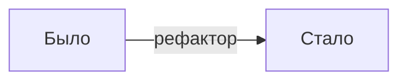

# 🙋‍ Перед началом

* Ты инициализировал чистый **Node.js** проект `%/projects/cypress/my_first_refactor`
* Ты установил Cypress `npm i cypress@9`

***

# Шаги

## 1. Базовый URL

- [x] Создай файл теста `signup.spec.js`
- [x] Скопируй код из [примера](cypress/integration/test_mama_project/signup.spec.js)
- [x] Проанализируй код и выпиши вопросы
- [x] Прогони тесты из файла в Cypress

*** 01:00 ***

Во всех тестах мы открываем один и тот же URL
```js
cy.visit('https://demo.realworld.io/');
```

И каждый раз повторяем этот участок кода. Пора это исправить!

- [x] Открой файл `~/cypress.json`
- [x] Добавь в него содержимое:
```json
{
    "baseUrl": "https://demo.realworld.io/"
}
```
- [x] Во всех тестах от**рефактор**и



<md-diff-code>

    <md-diff-left>
```js
describe('Sign up', () => {

    it('should do register user', () => {

        cy.visit('https://demo.realworld.io/');

        // test body ↓
    }

}
```
    </md-diff-left>
    <md-diff-right>
```js
describe('Sign up', () => {

    it('should do register user', () => {

        cy.visit('/');

        // test body ↓
    }

}
```
    </md-diff-right>

</md-diff-code>

* ❓ Зачем нужен файл `cypress.json`?
* ❓ Что такое базовый URL?

## 2. Хуки

> Хук (hook) — крючёк, ловушка, а по-сути перехват выполнения кода.

`beforeEach()` — позволяет выполнить участок кода перед запуском каждого теста `it()`

В каждом тесте мы повторяем открытие главной страницы приложения:
```js
cy.visit('/');
```

Закинем это в хук `beforeEach` и сократим наш код!

<md-diff-code>

    <md-diff-left>
```js
describe('Sign up', () => {

    it('should do register user', () => {

        cy.visit('/');

        // test body ↓
    }

    it('should do login user', () => {

        cy.visit('/');

        // test body ↓
    }

    it('should do logout user', () => {

        cy.visit('/');

        // test body ↓
    }

}
```
    </md-diff-left>
    <md-diff-right>
```js
describe('Sign up', () => {

    // will be executed before each it()
    beforeEach(() => {
        cy.visit('/');
    });

    it('should do register user', () => {

      // test body ↓
    }

    it('should do login user', () => {

        // test body ↓
    }

    it('should do logout user', () => {

        // test body ↓
    }

}
```
    </md-diff-right>

</md-diff-code>

Еще больше **хуков** можно подсмотреть на сайте [docs.cypress.io](https://docs.cypress.io/guides/core-concepts/writing-and-organizing-tests#Hooks)

## 3. Алиасы

Мы каждый раз повторяем селекторы для получения элементов:
```js
cy.get('.auth-page h1');
cy.get('.auth-page form')
cy.get('.auth-page form button[type=submit]')
```

Когда мы нашли нужный элемент на странице, мы можем сделать на него `.as()` ссылку:


И далее в коде использовать ссылку через `get('@')`


<md-diff-code>

    <md-diff-left>
```js
describe('Sign up', () => {

    it('should do register user', () => {

        cy.visit('https://demo.realworld.io/');

        // test body ↓
    }

}
```
    </md-diff-left>
    <md-diff-right>
```js
describe('Sign up', () => {

    it('should do register user', () => {

        // test body ↓

        cy.get('.auth-page').as('registerPage');
        cy.get('@registerPage').find('h1').should('have.text', 'Sign up');
        cy.get('@registerPage').find('form').should('be.visible').as('registerForm');

        // test body ...

        cy.get('@registerForm').find('button[type=submit]').click();
    }

}
```
    </md-diff-right>

</md-diff-code>

## 4. Фикстуры

## 5. Команды в Cypress

***