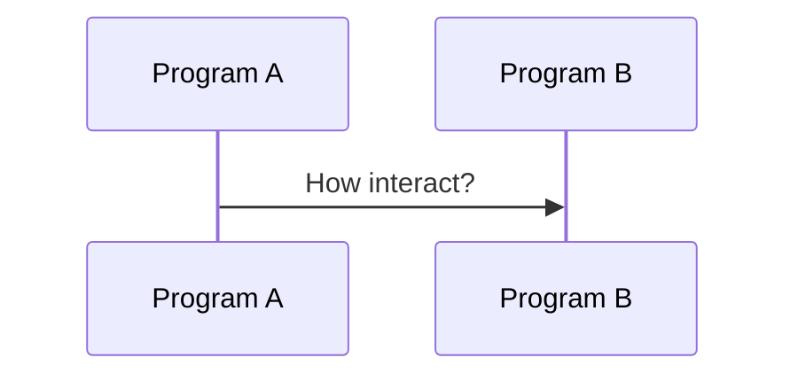
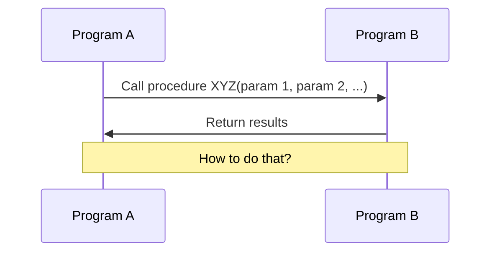
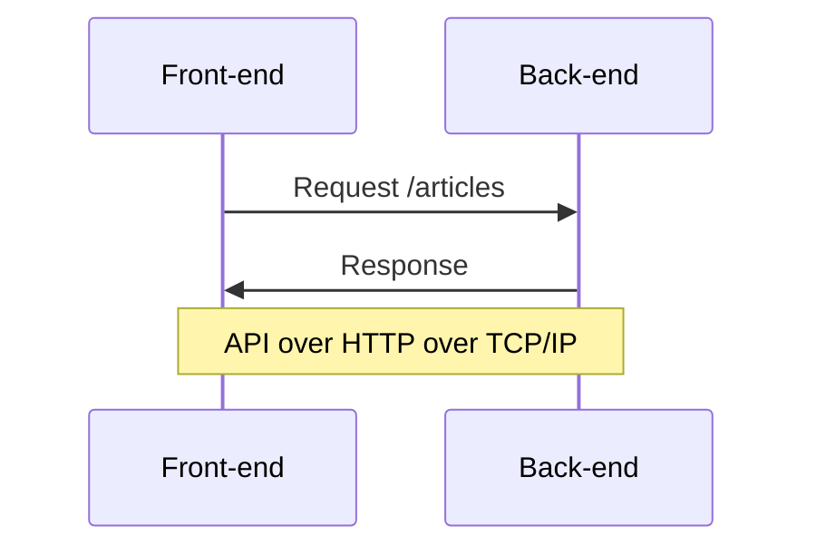

<md-hidden>
🛑 Данный туториал отображается на GitHub 🔴 не корректно! Это лишь исходник.<br>
Правильная версия https://www.epic1h.com/test_api
</md-hidden>

# Туториал: тестируем API в Cypress

Подойдет тем, кто хочет научиться выполнять HTTP запросы в Cypress.

# 👍 Что сделаем

* Научимся использовать Swagger и Postman.
* Научимся делать логин пользователя через API.
* Научимся тестировать ответы API бекенда в Cypress.

# 😍 Живая обратная связь

<import from="/partials/zoom_standups.md"></import>

# 💪 Минутка мотивации

А для поднятия боевого духа вот 👇

<iframe width="800" height="450" src="https://www.youtube.com/embed/60ZVdodaoUU?start=5" title="YouTube video player" frameborder="0" allow="accelerometer; autoplay; clipboard-write; encrypted-media; gyroscope; picture-in-picture; web-share" allowfullscreen></iframe>

***

# 🔢 Шаги

## +1. Ищем спецификацию на API

Да да, и снова твой любимый [Conduit](https://demo.realworld.io/)

- [x] Открой проект на [GitHub](https://github.com/gothinkster/realworld)
- [x] Найди ссылку на спецификацию: **View our starter guide & spec**
- [x] В спецификации перейди в раздел: **Frontend → API**
- [x] В документе найди раздел: **Swagger documentation**
- [x] Открой Swagger UI [https://api.realworld.io/api-docs](https://api.realworld.io/api-docs)

* ❓ Что такое Swagger?
* ❓ Что такое Open API?
* ❓ Что такое Swagger UI?
* ❓ Зачем нужна спецификация на API?

***

## +2. Играемся в Swagger UI

- [x] В Swagger UI найди эндпоинт `GET /articles`
- [x] Нажми **Try it out** и **Execute**

<details>
  <summary>Вот так вот 📹</summary>


</details>

* ❓ Что произошло?
* ❓ Что ты видишь на экране?
* ❓ Что такое эндпоинт?
* ❓ Что такое **Request URL**?
* ❓ Какой сервер обработал твой запрос?
* ❓ Что такое **Curl**?

***

- [x] Открой в новой вкладке браузера https://api.realworld.io/api/articles?limit=10&offset=0
- [x] Выполни данный запрос в Postman.

<details>
  <summary>Вот так вот 🖼️</summary>


</details>

* ❓ За что отвечают параметры `limit=10` и `offset=0`?

***

- [x] Открой https://demo.realworld.io/
- [x] Найди запрос на этот эндпоинт в инструментах разработчика.

<details>
  <summary>Вот так вот 🖼️</summary>


</details>

* ❓ Что ты видишь на экране?
* ❓ Где эти данные отражаются на сайте?

***

## +3. Контракты на API

**API** – интерфейс взаимодействия между программами. 



Программа `A` хочет вызвать процедуру `XYZ` у программы `B`



**Фронтент** — программа запущенная на клиенте в веб-браузере, **Бекенд** — на веб-сервере.



Намотай на 😅 ус:
* **TCP/IP** — нужен т.к. программы запущены на разных компьютерах.
* **HTTP** — потому, что исторически веб-браузер и веб-сервер используют этот протокол в Интернете.

**HTTP для API** — язык общения (слова), правила общения (как писать слова) — контракт.

<mark>Запомни → API = способ + правила общения</mark>

Как показывает [мой опыт](https://habr.com/ru/post/599127/), даже зрелые разработчики не всегда понимают, что такое **контракт на API.**

> Многие думают, что Swagger (Open API) – это «UI шкурка», которую генерирует бекенд.
> 
> Но Open API это в первую очередь – [JSON схема](https://github.com/OAI/OpenAPI-Specification/blob/main/schemas/v3.0/schema.yaml) описания API.

***

- [x] Открой контракт на API для бекенда [Conduit](https://github.com/gothinkster/realworld/blob/main/api/openapi.yml)
- [x] Скопируй контракт в редактор Swagger https://editor.swagger.io/
- [x] Найди описание контракта для эндпоинта `GET /articles`
- [x] Добавь новый `query` параметр в `YAML` в редакторе:

```yaml
- name: sorting
  in: query
  description: How to sort results
  required: false
  schema:
    type: string
    default: 'by_date_desc'
    enum:
        - 'by_date_desc'
        - 'mostly_liked'
```
- [x] Проверь, что в Swagger UI параметр отразился.

<details>
  <summary>Вот так вот 🖼️</summary>


</details>

* ❓ Как был создан файл `openapi.yml`?
* ❓ Что такое `YAML`?
* ❓ Что такое `required`?
* ❓ Что такое `default`?
* ❓ Что такое `enum`?
* ❓ Что позволяет сделать `sorting`?
* ❓ Мы уже можем сделать запрос к серверу?

***

- [x] Найди описание ответа от сервера на данный запрос.
- [x] Проинспектируй модель данных.
- [x] Найди описание модели `Articles` в `YAML`

<details>
  <summary>Вот так вот 📹</summary>


</details>

- [x] Добавь в **DTO** `Articles` новое поле `commentsCount`
- [x] Проверь, что в Swagger UI контракт обновлен.

* ❓ Какого типа будет поле?
* ❓ Что такое DTO?
* ❓ Что такое `$ref` в YAML?

```markdown quiz have_we_comments_count horizontal
❓ На сервере это поле уже появилось?

- [ ] Да
- [x] Нет


Конечно **нет!** Мы только добавили поле в контракт.

Теперь нужно идти к бекенд разработчикам и:
1. **согласовать** изменения в контракте,
2. дождаться **обновления** кода бекенда на сервере.
```

***

## +4. Тестирование ендпойнта

- [x] Инициализируй чистый проект `%/projects/cypress/test_api`
- [x] Добавь новый файл теста `test-api.spec.js` с содержимым:

```js
///<reference types="cypress" />
import { getRandomNumber } from '/cypress/support/utils';

const BACKEND_BASE_URL = 'https://api.realworld.io/api';
const DEFAULT_BASE_URL = Cypress.config('baseUrl');

before(() => {
    cy.log('set base url to backend');
    Cypress.config('baseUrl', BACKEND_BASE_URL);
});

after(() => {
    cy.log('reset base url');
    Cypress.config('baseUrl', DEFAULT_BASE_URL);
});

describe('API', () => {

    describe('Articles', () => {

        it('should do retrieve articles list', () => {

            cy.request('GET', '/api/articles')
                .then(({ status, body }) => {
                    debugger;

                    // checking HTTP status
                    expect(status).to.eq(201);

                    // checking base response
                    expect(body).to.have.all.keys('articles', 'articlesCount');

                    // checking random article
                    const rnd = getRandomNumber(0, 9);
                    cy.log(`checking ${rnd} article`);
                    const article = body.articles[rnd];
                    expect(article).to.have.all.keys(
                        'slug',
                        'title',
                        'createdAt',
                        'author',
                        'description',
                        'tagList',
                        'body',
                        'favorited',
                        'favoritesCount',
                        'updatedAt'
                    );
                    expect(article.slug).to.not.be.empty;
                    expect(article.title).to.not.be.empty;
                    expect(article.createdAt).to.not.be.empty;
                    expect(article.author).to.not.be.empty;
                    expect(article.description).to.not.be.empty;
                    expect(article.body).to.not.be.empty;

                    expect(article.favorited).to.be.a('boolean');
                    expect(article.favoritesCount).to.be.a('number');

                    // checking author
                    const { author } = article;
                    expect(author).to.have.all.keys('bio', 'following', 'image', 'username');
                    expect(author.following).to.be.a('boolean');

                    expect(author.username).to.not.be.empty;
                    expect(author.image).to.match(/^https/);
                });

        });

    });

});
```

- [x] Сделай так, что бы тест 🟢 заработал.

<mark>Сразу хочешь сбежать в подсказки 🤨? Скучно?</mark>

На работе ты **постоянно** будешь разбираться с **неработающим кодом** – это важный навык.

<details>
  <summary>Что делать?</summary>

- [x] Исправь адрес ендпойнта:

```diff
- cy.request('GET', '/api/articles')
+ cy.request('GET', '/articles')
```

- [x] Исправь код ответа:

```diff
- expect(status).to.eq(201)
+ expect(status).to.eq(200)
```

- [x] Создай файл `~/cypress/support/utils.js`

```js
export function getRandomNumber(min, max) {
    return Math.round(Math.random() * (max - min)) + min;
}
```
</details>

***

* ❓ За что отвечает `Cypress.config`?
* ❓ Зачем нужны хуки `before` и `after`?
* ❓ В каком случае они бы не потребовались?

***

## +5. Инспектирование ответа от API

А сейчас, я еще **сэкономлю тебе кучу времени** в будущем!

- [x] Открой инструменты разработчика в Сypress.
- [x] Перезапусти тест.
- [x] Проинспектируй код теста в отладчике.

<video class="cornered" width="600px" controls>
  <source src="assets/test_api/use_debugger.mp4" type="video/mp4">
</video>

* ❓ Что позволяет сделать `debugger` в коде?

***

## +6. Сhai.js

`expect` – это **супер функция** библиотеки утверждений **Сhai.js** которую включает в себя Cypress.

❓ Почему именно **супер функция**?

- [x] Установи библиотеку `npm install chai --save-dev`
- [x] Добавь новый файл `~/js_examples/chai.js` с содержимым:

```js
const { expect } = require('chai');

const article = {
    slug: null,
    title: null,
    createdAt: '2022-12-01',
    description: null,
    body: null,
    favorited: 1,
    favoritesCount: '5',
    updatedAt: null
};

expect(article).to.have.all.keys(
    'slug',
    'title',
    'createdAt',
    'description',
    'tagList',
    'body',
    'favorited',
    'favoritesCount',
    'updatedAt'
);

const DATE_FORMAT = /^\d{2}\-\d{2}\-\d{4}$/;

expect(article.slug).to.not.be.empty;
expect(article.title).to.not.be.empty;
expect(article.createdAt).to.not.be.empty;
expect(article.createdAt).match(DATE_FORMAT, 'wrong created at date format');
expect(article.description).to.not.be.empty;
expect(article.tagList).to.be.instanceof(Array);
expect(article.tagList).have.length.greaterThan(2);
expect(article.favorited).to.be.a('boolean');
expect(article.favoritesCount).to.be.a('number');
expect(article.updatedAt).match(DATE_FORMAT, 'wrong updated at date format');
```

- [x] Запусти файл `node js_examples/chai.js`
- [x] Ознакомься с [API](https://www.chaijs.com/api/bdd/) библиотеки.
- [x] Исправь код, что бы файл выполняется без ошибок.

***

- [x] Приведи свой код в соответствии с [эталоном](/js_examples/chai.js)

## +7. Тест API регистрации пользователя

### 7.1. Позитивный тест

- [x] Найти контракт на ендпойнт `POST /users`
- [x] Выполни в Postman запрос с полезной нагрузкой (payload):

```json
{ "user": { "username": "?", "email": "?", "password": "?" } }
```

- [x] Напиши позитивный тест регистрации пользователя.
- [x] Используй `faker` для генерации данных для отправки.

***

- [x] Приведи свой код в соответствии с [эталоном](/cypress/integration/test-api.spec.js#L73)

* ❓ За что отвечает поле `token` в ответе от сервера?

***

### 7.2. Негативный тест

Негативные тест кейсы базируются на работе с неверными данными. 

> **Цель негативных тестов** — проверка реакции системы на ввод некорректных параметров.

- [x] Выполни через Postman запрос:

```text
POST https://api.realworld.io/api/users
{ "user": { "username": "", "email": "", "password": "" } }
```

* ❓ Какой код ответа получен от сервера?
* ❓ Что находится внутри тела ответа?

***

- [x] Добавь новый тест:

```js
it.only('should not do register user with empty data', () => {

    const payload = {
        user: { username: '', email: '', password: '' }
    };

    cy.request({ method: 'POST', url: '/users', body: payload, failOnStatusCode: false })
        .then(({ status, body }) => {
            expect(status).to.eq(422);
            expect(body).to.have.key('errors');
            const {errors} = body;
            expect(errors).to.have.key('email');
            const {email} = errors;
            expect(email).to.have.lengthOf(1);
            const message = email.join('');
            expect(message).to.have.eq('can\'t be blank');
        });

});
```

* ❓ Что проверяет данный тест?
* ❓ Зачем нужна передача `failOnStatusCode`?
* ❓ Зачем в коде делать `join`?
* ❓ Какие еще негативные тесты можно сделать на данный ендпойнт?

***

## +8. Логин пользователя через API

`cy.request` в Сypress можно использовать не только для тестирования API, но и для вспомогательных задач.

Вспомни [свой код](cypress/integration/finish_mama_project/articles/crud.spec.js) из туториала [заканчиваем мама проект](@finish_mama_project)

Перед всеми тестами требующими **авторизацию пользователя** ты повторял **шаги входа**, функция – `login()`

**Что, если бы ты мог:**
* пройти авторизацию 1 раз перед началом всех тестов через API,
* получить **JWT** токен от сервера,
* перед каждым `cy.visit` подставить токен в браузер?

- [x] Найти контракт на ендпойнт `POST /users/login`
- [x] Выполни в Postman запрос с полезной нагрузкой (payload) и получи токен:

```text
↓ Request
POST https://api.realworld.io/api/users/login
{ "user": { "email": "?", "password": "?" } }

↓ Response
{
  "token": "XYZ"
}
```

`XYZ` – это токен для твоего пользователя.

- [x] Зайди на https://demo.realworld.io/
- [x] Если ты авторизован, то выйди.
- [x] В DevTools в локальное хранилище установи `jwtToken=XYZ`

* ❓ Что такое `JWT` токен?
* ❓ Что такое `local storage` в браузере?
* ❓ Чем `local storage` отличается от печенек?
* ❓ В каком HTTP заголовке токен передается на сервер?
* ❓ Почему такой подход лучше повторения входа через форму каждый раз?

***

- [x] Переключись на проект `finish_mama_project`
- [x] Добавь в файл `~/cypress/support/index.js`

```js
///<reference types="cypress" />
import meUser from '/cypress/fixtures/me-user.json';

before(() => {
    const { email, password } = meUser;
    cy.request('POST', 'https://api.realworld.io/api/users/login',
        { user: { email, password } })
        .then(({ status, body }) => {
            expect(status).to.eq(200);
            expect(body).to.have.key('user');
            const { user } = body;
            cy.writeFile('token.txt', user.token);
        });
});
```

- [x] Добавь в файл `~/cypress/support/utils.js`

```js
export function setJwtToken(window, token) {
    window.localStorage.setItem('jwtToken', token);
}
```

- [x] В каждом тесте где требуется авторизованный пользователь:

```js
import meUser from '/cypress/fixtures/me-user.json';
import { setJwtToken } from '/cypress/support/utils';

it('should do publish article', () => {
  
  cy.readFile('token.txt')
    .should('not.be.empty')
    .then(token => {
        cy.visit('/', {
            onBeforeLoad: (window) => setJwtToken(window, token)
        });
    });
  cy.get('.navbar').should('be.visible')
    .should('contain.text', meUser.username);

  // test body here

});
```

***

- [x] Выполни прогон тестов в Headless.

* ❓ Во сколько раз ускорилось выполнение?

***

## +9. Авторизация в API запросах

Для тестирования API фичей, требующих авторизацию пользователя так же потребуется передача токена.

**Токен передается в HTTP запросе в специальном заголовке:**

```text
Authorization: Token XYZ
```

❗ Это не всегда может быть так. Как реализовать авторизацию решают сами разработчики!

- [x] Залогинься на фронтенде https://demo.realworld.io/
- [x] Найди данный заголовок в XHR запросах.
- [x] Напиши тест для ендпойнта `GET /user`

***

- [x] Приведи свой код в соответствии с [эталоном](/cypress/integration/test-api.spec.js#L123)

Та да 🥳 Ты дошел до конца.

# 😭 Домашка

Напиши по **1 позитивному** и по **2 негативных** теста на API для фичей:
- [ ] Добавления статьи.
- [ ] Редактирования статьи.
- [ ] Удаления статьи.
- [ ] Выхода пользователя.

# Фидбек пожалуйста 🙏

<import from="/partials/tutorial_feedback.md"></import>

# Читать и смотреть

1. [Визуальный редактор контрактов на API](https://habr.com/ru/post/599127/)
2. [Баги в API Хабра или 500 – это нормально?](https://habr.com/ru/post/647957/)
3. [Автотестирование API с помощью ИИ](https://www.youtube.com/watch?v=NP6LL5e52vU)
