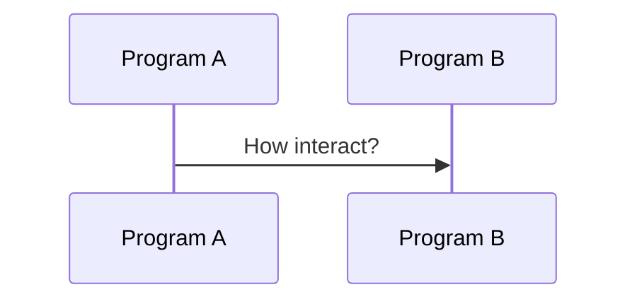
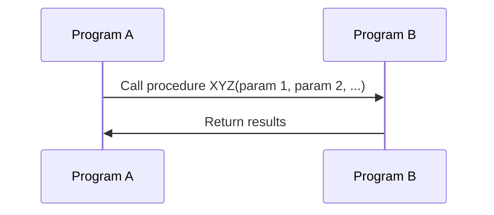
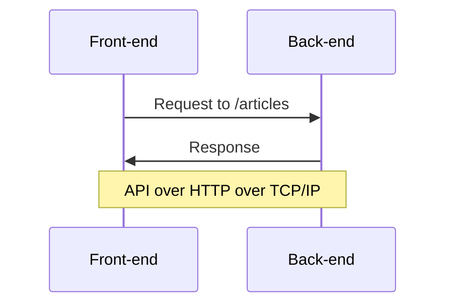

# Туториал: тестируем API в Cypress

Подойдет тем, кто хочет научиться выполнять HTTP запросы в Cypress.

# 👍 Что сделаем

* Научимся использовать Swagger и Postman.
* Научимся тестировать ответы от API бекенда в Cypress.
* Научимся делать логин пользователя через API.

***

# 🔢 Шаги

## 1. Ищем спецификацию на API

Да да, и снова твой любимый [Conduit](https://demo.realworld.io/)

- [x] Открой проект на [GitHub](https://github.com/gothinkster/realworld)
- [x] Найди ссылку на спецификацию: **View our starter guide & spec**
- [x] В спецификации перейди в раздел: **Frontend → API**
- [x] В документе найди раздел: **Swagger documentation**
- [x] Открой Swagger UI [https://api.realworld.io/api-docs](https://api.realworld.io/api-docs)

* ❓ Что такое Swagger?
* ❓ Что такое Open API?
* ❓ Что такое Swagger UI?
* ❓ Зачем нужна спецификация на API?

***

## 2. Играемся в Swagger UI

- [x] В Swagger UI найди эндпоинт `GET /articles`
- [x] Нажми **Try it out** и **Execute**

<details>
  <summary>Вот так вот 📹</summary>


</details>

* ❓ Что произошло?
* ❓ Что ты видишь на экране?
* ❓ Что такое эндпоинт?
* ❓ Что такое **Request URL**?
* ❓ Что такое **Curl**?

***

- [x] Открой в новой вкладке браузера https://api.realworld.io/api/articles?limit=20&offset=0
- [x] Выполни данный запрос в Postman.

<details>
  <summary>Вот так вот 🖼️</summary>


</details>

* ❓ За что отвечают параметры `limit=20` и `offset=0`?

***

- [x] Открой https://demo.realworld.io/
- [x] Найди запрос на этот эндпоинт в инструментах разработчика.

<details>
  <summary>Вот так вот 🖼️</summary>


</details>

* ❓ Что ты видишь на экране?
* ❓ Где эти данные отражаются на сайте?

***

## 3. Контракты на API

**API** – интерфейс взаимодействия между программами. 



Программа `A` хочет вызвать процедуру `XYZ` у программы `B`



**Фронтент** — программа запущенная на клиенте в браузере, **Бекенд** — на веб-сервере.



**TCP/IP** — т.к. программы запущены на разных компьютерах.

**HTTP** — потому что исторически браузер и веб-сервер используют этот протокол в Интернете.

```markdown quiz have_we_comments_count horizontal
❓ Это плохой API?

- [ ] 1
- [ ] 2
- [ ] 3


```

***

<mark>Зафиналим: API = способ + правила общения</mark>

Как показывает [мой опыт](https://habr.com/ru/post/599127/), даже зрелые разработчики не всегда понимают, что такое **контракт на API.**

> Многие думают, что Swagger (Open API) – это «UI шкурка», которую генерирует в конечном счете бек из кода, они не понимают, что это в первую очередь – JSON схема описания API.

***

- [x] Открой контракт на API для бекенда [Conduit](https://github.com/gothinkster/realworld/blob/main/api/openapi.yml)
- [x] Скопируй контракт в редактор Swagger https://editor.swagger.io/
- [x] Найди описание контракта для эндпоинта `GET /articles`
- [x] Добавь новый `query` параметр в `YAML` в редакторе:

```yaml
- name: sorting
  in: query
  description: How to sort results
  required: false
  type: string
  default: 'by_date_desc'
  enum:
    - 'by_date_desc'
    - 'mostly_liked'
```
- [x] Проверь, что в Swagger UI параметр отразился.

<details>
  <summary>Вот так вот 🖼️</summary>


</details>

* ❓ Как был создан файл `openapi.yml`?
* ❓ Что такое `YAML`?
* ❓ Что такое `required`?
* ❓ Что такое `default`?
* ❓ Что такое `enum`?
* ❓ Мы уже можем сделать запрос к серверу с `sorting`?

***

- [x] Найди описание ответа от сервера на данный запрос.
- [x] Проинспектируй модель данных.
- [x] Найди описание модели `Articles` в `YAML`

<details>
  <summary>Вот так вот 📹</summary>


</details>

- [x] Добавь в DTO `Articles` новое поле `commentsCount`
- [x] Проверь, что в Swagger UI контракт обновлен.

* ❓ Какого типа будет поле?
* ❓ Что такое DTO?
* ❓ Что такое `$ref` в YAML?

```markdown quiz have_we_comments_count horizontal
❓ На сервере это поле уже появилось?

- [ ] Да
- [x] Нет


Конечно нет! Мы только добавили поле в контракт.

Теперь нужно идти к бекенд разработчикам и:
* Согласовать изменения в контракте.
* Дождаться обновления кода бекенда.
```

***

## 3. Тестирование ендпойнта

- [x] Добавь новый файл теста `test-api.spec.js` с содержимым:

```js
///<reference types="cypress" />
import { getRandomNumber } from '/cypress/support/utils';

const BACKEND_BASE_URL = 'https://api.realworld.io/';
const DEFAULT_BASE_URL = Cypress.config('baseUrl');

before(() => {
    cy.log('set base url to backend');
    Cypress.config('baseUrl', BACKEND_BASE_URL);
});

after(() => {
    cy.log('reset base url');
    Cypress.config('baseUrl', DEFAULT_BASE_URL);
});

describe('API', () => {

    describe('Articles', () => {

        it('should do retrieve articles list', () => {

            cy.request('GET', '/api/articles')
                .then(({ status, body }) => {
                    // checking HTTP status
                    expect(status).to.eq(200);

                    // checking base response
                    expect(body).to.have.all.keys('articles', 'articlesCount');

                    // checking random article
                    const rnd = getRandomNumber(0, 9);
                    cy.log(`checking ${rnd} article`);
                    const article = body.articles[rnd];
                    expect(article).to.have.all.keys(
                        'slug',
                        'title',
                        'createdAt',
                        'author',
                        'description',
                        'tagList',
                        'body',
                        'favorited',
                        'favoritesCount',
                        'updatedAt'
                    );
                    expect(article.slug).to.not.be.empty;
                    expect(article.title).to.not.be.empty;
                    expect(article.createdAt).to.not.be.empty;
                    expect(article.author).to.not.be.empty;
                    expect(article.description).to.not.be.empty;
                    expect(article.body).to.not.be.empty;

                    expect(article.favorited).to.be.a('boolean');
                    expect(article.favoritesCount).to.be.a('number');

                    // checking author
                    const { author } = article;
                    expect(author).to.have.all.keys('bio', 'following', 'image', 'username');
                    expect(author.following).to.be.a('boolean');

                    expect(author.username).to.not.be.empty;
                    expect(author.image).to.match(/^https/);

                    debugger;
                });

        });

    });

});
```

- [x] Сделай так, что бы тест заработал.
- [x] Проверь, что тест 🟢 проходит.

* ❓ За что отвечает `Cypress.config`?
* ❓ Зачем нужны хуки `before` и `after`?

***

## 4. Инспектирование ответа от API

- [x] Открой инструменты разработчика в Сypress.
- [x] Перезапусти тест.

`expect` – это супер функция 

https://www.chaijs.com/api/bdd/
