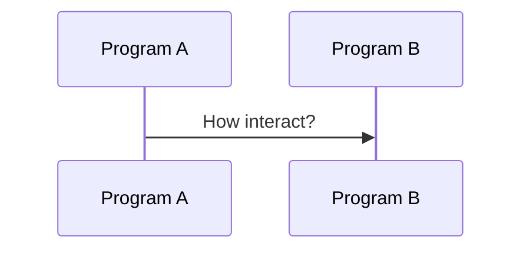
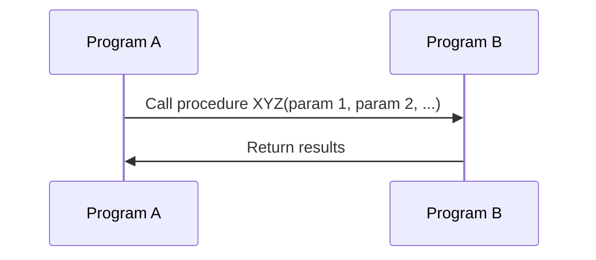
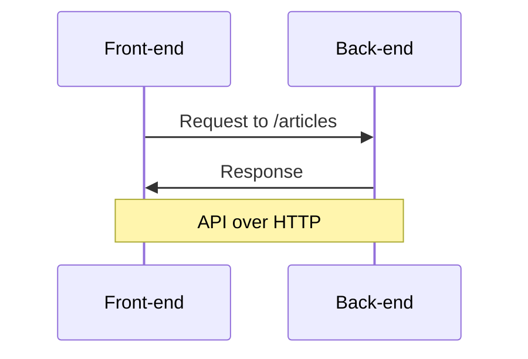

# Туториал: тестируем API в Cypress

Подойдет тем, кто хочет научиться выполнять HTTP запросы в Cypress.

# 👍 Что сделаем

* Научимся использовать Swagger и Postman.
* Научимся тестировать ответы от API бекенда в Cypress.
* Научимся делать логин пользователя через API.

***

# 🔢 Шаги

## 1. Ищем спецификацию на API

Да да, и снова твой любимый [Conduit](https://demo.realworld.io/)

- [x] Открой проект на [GitHub](https://github.com/gothinkster/realworld)
- [x] Найди ссылку на спецификацию: **View our starter guide & spec**
- [x] В спецификации перейди в раздел: **Frontend → API**
- [x] В документе найди раздел: **Swagger documentation**
- [x] Открой Swagger UI [https://api.realworld.io/api-docs](https://api.realworld.io/api-docs)

* ❓ Что такое Swagger?
* ❓ Что такое Open API?
* ❓ Что такое Swagger UI?
* ❓ Зачем нужна спецификация на API?

***

## 2. Играемся в Swagger UI

- [x] В Swagger UI найди эндпоинт `GET /articles`
- [x] Нажми **Try it out** и **Execute**

<details>
  <summary>Вот так вот 📹</summary>


</details>

* ❓ Что произошло?
* ❓ Что ты видишь на экране?
* ❓ Что такое эндпоинт?
* ❓ Что такое **Request URL**?
* ❓ Что такое **Curl**?

***

- [x] Открой в новой вкладке браузера https://api.realworld.io/api/articles?limit=20&offset=0
- [x] Выполни данный запрос в Postman.

<details>
  <summary>Вот так вот 🖼️</summary>


</details>

* ❓ За что отвечают параметры `limit=20` и `offset=0`?

***

- [x] Открой https://demo.realworld.io/
- [x] Найди запрос на этот эндпоинт в инструментах разработчика.

<details>
  <summary>Вот так вот 🖼️</summary>


</details>

* ❓ Что ты видишь на экране?
* ❓ Где эти данные отражаются на сайте?

***

## 3. Контракты на API

**API** – интерфейс взаимодействия между программами. 



Программа `A` хочет вызвать процедуру `XYZ` у программы `B`



**Фронтент** — программа запущенная на клиенте, **Бекенд** — на сервере.



HTTP — нужен, т.к. программы запущены на разных компьютерах.

**API** — это канал через который программы общаются.

**Контракт на API** — это набор правил для общения.

Как показывает [мой опыт](https://habr.com/ru/post/599127/), даже зрелые разработчики не всегда понимают, что такое **контракт на API.**

> Многие думают, что Swagger (Open API) – это «UI шкурка», которую генерирует в конечном счете бек из кода, они не понимают, что это в первую очередь – JSON схема описания API.

***

- [x] Открой контракт на API для бекенда [Conduit](https://github.com/gothinkster/realworld/blob/main/api/openapi.yml)
- [x] Скопируй контракт в редактор Swagger https://editor.swagger.io/
- [x] Найди описание контракта для эндпоинта `GET /articles`
- [x] Добавь новый `query` параметр в `YAML` в редакторе:

```yaml
- name: sorting
  in: query
  description: How to sort results
  required: false
  type: string
  default: 'by_date_desc'
  enum:
    - 'by_date_desc'
    - 'mostly_liked'
```
- [x] Проверь, что в Swagger UI параметр отразился.

<details>
  <summary>Вот так вот 🖼️</summary>


</details>

* ❓ Что такое `YAML`?
* ❓ Что такое `required`?
* ❓ Что такое `default`?
* ❓ Что такое `enum`?
* ❓ Мы уже можем сделать запрос к серверу с `sorting`?

https://www.chaijs.com/api/bdd/

