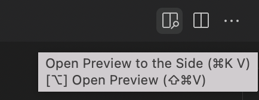

# Туториал: тестируем мама проект на Cypress

Подойдет тем, кто хочет научиться писать авто-тесты на примере реального комплексного WEB-приложения.

# 👍 Что сделаем

* Опишем тест-кейсы на основе спецификации на проект.
* Напишем код для тестов.

# 🙋‍ Перед началом

* Ты инициализировал чистый **Node.js** проект `%/projects/cypress/test_conduit`
* Ты установил Cypress `npm i cypress@9`

# Дисклеймер

* 🤭 Сейчас твой код будет не очень.
* 😉 В следующем туториале твой код будет лучше.
* 😜 Еще через пару туториалов он будет прекрасен.

***

# 🔢 Шаги

## 1. Мама всех демо-приложений

[Conduit](https://demo.realworld.io/) — open source клон [medium.com](https://www.medium.com)
> 
> The mother of all demo apps — exemplary fullstack Medium.com clone powered by React, Angular, Node, Django, and many more 🏅

**Задача: познакомится со спецификацией на проект.**

- [x] Открой проект на [GitHub](https://github.com/gothinkster/realworld)
- [x] Найди ссылку на спецификацию: **View our starter guide & spec**
- [x] В спецификации найди раздел: **Frontend → Routing**

<details>
  <summary>Не получается 📹</summary>

Что серьезно, не смог найти? 😱

</details>

* ❓ Что описано в документе?
* ❓ Чем это может быть полезно для составления текст-кейсов?

***

## 2. Пишем тест-кейсы на вход и регистрацию

[Routing guidelines](https://realworld-docs.netlify.app/docs/specs/frontend-specs/routing/) — дает нам представление о структуре приложение и его функциональных возможностей.

Это помогает нам понять, что мы будем тестировать.

👇 Напишем тест-кейсы для фичей **регистрации** и **входа.**

<block>

### User sign up test case

#### It should do register user:
1. Open https://demo.realworld.io/
1. Click **Sign Up** link in app header
1. Url should be `/#/register`
1. Page title should be **Sign up**
1. Page should have form
1. Type `{user_name}` into **Username** form field
1. Type `{email}` into **Email** form field
1. Type `{password}` into **Password** form field
1. Click on **Sign up** button
1. Header should contains `{user_name}`

#### Where:
* `{user_name}`
  * string with pattern `[0-9a-zA-Z_]{5, 10}`
  * was not registered before
* `{email}`
  * valid email
  * was not registered before
* `{password}` — string with pattern `[0-9a-zA-Z_]{6, 16}`

</block>

<block>

### User sign in test case

#### It should do login user:
1. Open https://demo.realworld.io/
1. Click **Sign In** link in app header
1. Url should be `/#/login`
1. Page title should be **Sign in**
1. Page should have form
1. Type `{email}` into **Email** form field
1. Type `{password}` into **Password** form field
1. Click on **Sign in** button
1. Header should contains `{user_name}`

#### Where:
* `{email}`
  * valid email
  * was registered before
* `{password}` — current user password
* `{user_name}` — registered user name for `{email}`

</block>

- [x] Переведи тесты на русский язык и проговори их.
- [x] Выполни их в ручную.

*** 02:00 ***

## 3. Переносим тест-кейсы в код

- [x] Создай файл теста `signup.js`
- [x] Добавь заготовку для кода теста:

```javascript
describe('Sign up', () => {
    
    it.only('should do register user', () => {
        
        // TODO: write test body
        // cy.visit();
        // cy.get().click();
        // cy.url().should('include', 'xyz');
        // cy.get().should('have.text', 'xyz');
        // cy.get().should('be.visible');
        // cy.get().type();
        // cy.get().should('contain.text', 'xyz');

    });

    it('should do login user', () => {

        // TODO: write test body

    });

});
```
- [x] Напиши тело теста регистрации пользователя самостоятельно.

* ❓ Чем отличается `it.only()` от `it()`?

*** 15:00 ***

В тест-кейсе описано, что имя пользователя и пароль не должны быть зарегистрированы ранее.

Поэтому, необходимо при каждом запуске теста, генерировать новое имя пользователя и email.

- [x] Добавь в код теста

```javascript
const rnd = Math.round(Math.random() * 8999) + 1000;
const username = 'user_' + rnd;
cy.get('.auth-page form input[ng-model$=username]').type(username);

const email = username + '@gmail.com';
cy.get('.auth-page form input[ng-model$=email]').type(email);
```

* ❓ Что делает `Math.random` и `Math.round`?
* ❓ Что фактически хранится в константе `rnd`?

*** 15:00 ***

- [x] Сверь свой код с [примером](cypress/integration/test_mama_project/signup1.spec.js)
- [x] Перенеси к себе участки кода которые пропустил.
- [x] Запусти тест в **Headless** режиме. 

*** 5:00 ***

- [x] Напиши тело теста логина пользователя.

*** 10:00 ***

- [x] Сверь свой код с [примером](cypress/integration/test_mama_project/signup2.spec.js)
- [x] Перенеси к себе участки кода которые пропустил.

*** 05:00 ***

## 4. Еще 10+ тест-кейсов!

Продолжая следовать спецификации, а так же выполнив визуальный анализ приложения мы можем дополнить список фичей. 

- [x] Создай файл `~/test_cases/README.md`
- [x] Добавь Markdown:

```markdown
# Sign up
* [register user](register_user.md)
* [login user](login_user.md)
* logout user

# Commenting 
* add comment
* delete comment

# Articles 
* publish article
* edit article
* delete article
* read article
* like article
* global articles feed
* filter articles by tag

# Social
* subscribe to user
* unsubscribe from user

# User settings
* edit settings
```

- [x] Создай файлы `test_cases/register_user.md` и `test_cases/login_user.md`
- [x] Перенеси в них Markdown из примеров [register](test_cases/register_user.md?plain=1) и [login](test_cases/login_user.md?plain=1)
- [x] Открой файл `README.md` в режиме просмотра.


* ❓ Что ты видишь?

***

## 5. Тест-кейс выход пользователя

- [x] Создай файл  `~/test_cases/logout_user.md`
- [x] Опиши тест-кейс для фичи **logout user** в Markdown
- [x] Добавь ссылку на новый файл в `README.md`

*** 10:00 ***

- [x] Сверь свой результаты с примером [logout user](test_cases/logout_user.md?plain=1)
- [x] Напиши тест на Cypress.

*** 10:00 ***

- [x] Сверь свой код с [примером](cypress/integration/test_mama_project/signup.spec.js)

## 5. Еще больше тестов

Повтори эти действия для оставшихся фичей в `README.md`:

- [x] Опиши тест-кейс для фичи в Markdown.
- [x] Добавь ссылку в `README.md`
- [x] Напиши код следуя описанию тест-кейса.

*** 30:00 ***

Та да 🥳 Ты дошел до конца.

- [x] Сверь описание тест-кейсов с [примерами](test_cases/test_mama_project)
- [x] Сверь тесты с [примерами](cypress/integration/test_mama_project)
- [x] Подсмотри фишки и улучши свой код!

# Что дальше?

- У тебя вопросы?
- Тебе нужна поддержка и мотивация?

Каждый вторник и четверг я провожу стендапы в Zoom со всеми желающими.

Все подробности тут в телеграмм 👉 https://t.me/epic_one_hour 

@[Anton Breslavsky|https://t.me/breslavsky_anton|https://s.epic1h.com/api/public/dl/nfCyhZhd?inline=true]
